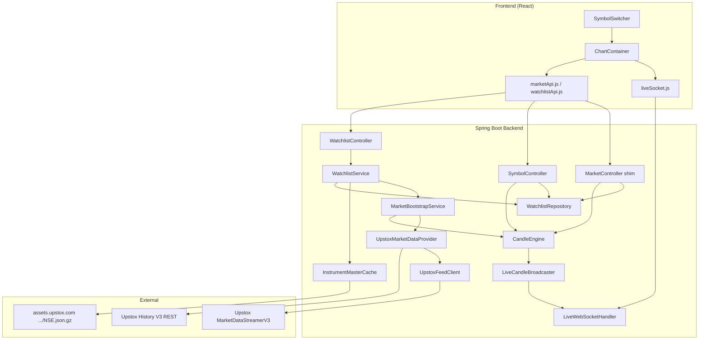
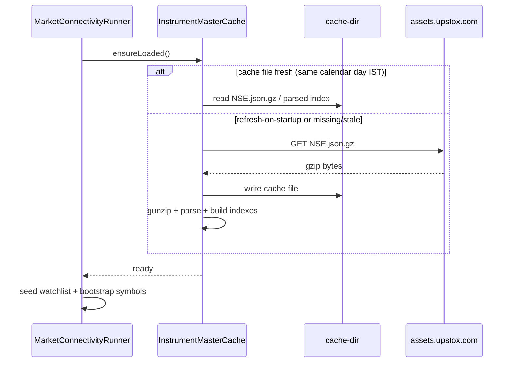
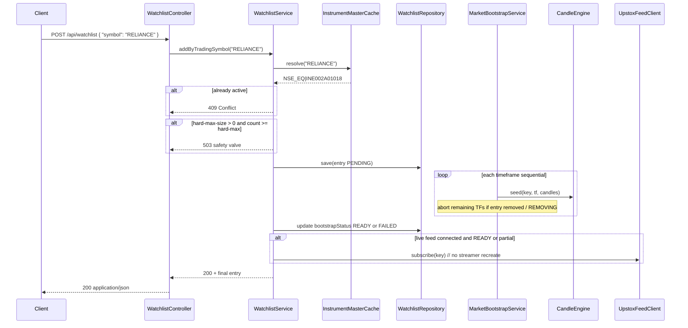
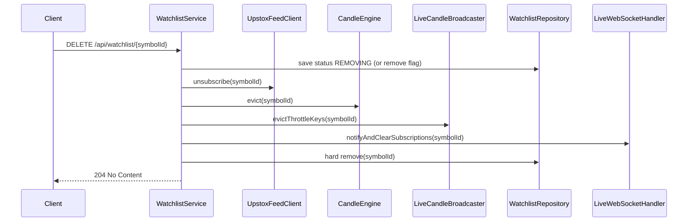
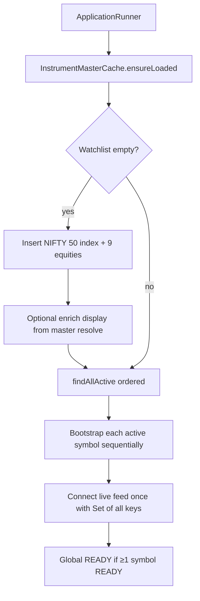
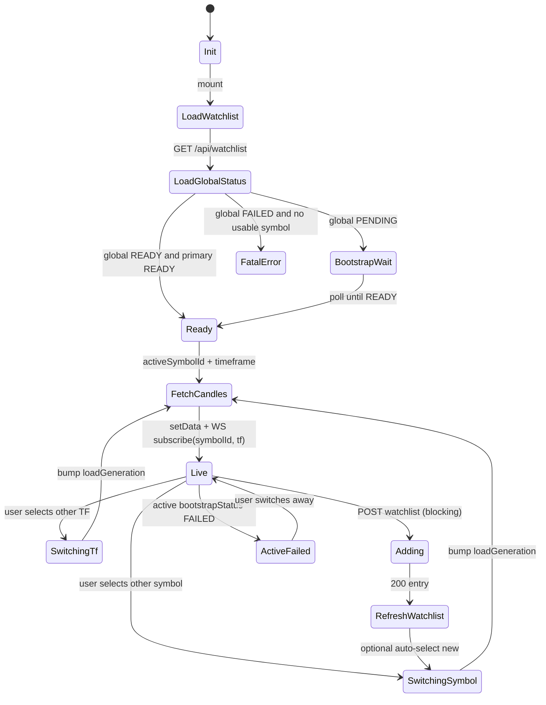

# Multi-Symbol Watchlist Support (In-Memory First)

| Field | Value |
|---|---|
| **Document** | Design — Multi-Symbol Watchlist Support |
| **Author** | (TBD) |
| **Date** | 2026-07-10 |
| **Status** | Approved for implementation (rev 5 — seed NIFTY 50 index + 9 top equities, hard cap 50) |
| **Workspace** | `C:\Users\Khasim\Desktop\tradingapp\TIP` |
| **Supersedes (partially)** | Architecture-Design-v1.0 §9.2 (Postgres-first, max 10); Implementation-Plan-v1.0 Phase 3 |

---

## Overview

TIP currently operates as a **single-symbol MVP**: one instrument is hardcoded via `tip.market.default-symbol` / `default-instrument-key`, session recovery seeds only that instrument, the live Upstox feed subscribes to a single key, and WebSocket subscribe rejects any other `symbolId` with `"Unknown symbolId for MVP1"`. The candle engine itself is already multi-key (`instrumentKey|timeframe` in a `ConcurrentHashMap`), so the bottleneck is orchestration, APIs, and feed lifecycle—not candle state storage.

This design introduces an **editable multi-symbol watchlist** with:

1. A `WatchlistRepository` abstraction (`InMemoryWatchlistRepository` first; Postgres later as a drop-in).
2. Local **Upstox instrument master cache** for trading-symbol → instrument-key resolution (no live search API per add).
3. Full backend lifecycle: resolve → persist to watchlist → seed all timeframes → live-feed subscribe; reverse on remove.
4. REST watchlist CRUD + per-symbol candles aligned with `Data-Flow-and-Frontend-API-Spec-v1.0.md`.
5. WebSocket validation against the active watchlist (any watchlist symbol, not only default).
6. A **thin frontend symbol switcher** that drives the existing chart (no tiles/sparklines yet).

**Startup seed** is **10 instruments**: the **NIFTY 50 index** plus **9 top Nifty 50 equities** (pinned ordered list). Users may add more symbols via `POST /api/watchlist` up to a **hard product cap of 50**. Soft-warn at 40; add rejects with **409** when active count ≥ 50.

---

## Background & Motivation

### Current state (facts from code)

| Component | Path | Behavior today |
|---|---|---|
| Config | `backend/.../config/MarketProperties.java`, `application.yml` | Single `defaultSymbol` / `defaultInstrumentKey` (RELIANCE) |
| REST | `backend/.../api/MarketController.java` | `/api/market/candles` always uses `defaultInstrumentKey` |
| Bootstrap | `backend/.../market/MarketBootstrapService.java` | Seeds one instrument × all supported TFs; connects live feed for that key only |
| Candle state | `backend/.../market/CandleEngine.java` | Already keyed by `instrumentKey + "|" + timeframe` — multi-symbol ready; **unbounded** closed-candle lists (no trim) |
| Live feed | `backend/.../market/UpstoxFeedClient.java` | `new MarketDataStreamerV3(apiClient, Set.of(instrumentKey), Mode.FULL)` — single set at construct; **SDK also exposes `subscribe(Set, Mode)` / `unsubscribe(Set)`** |
| Provider | `backend/.../market/MarketDataProvider.java` | `connectLiveFeed(String instrumentKey, TickHandler)` — single-key signature |
| WS | `backend/.../api/websocket/LiveWebSocketHandler.java` | Rejects non-default `symbolId`; broadcast filter already works per `symbolId\|timeframe` |
| Broadcaster | `backend/.../api/websocket/LiveCandleBroadcaster.java` | Throttles per `instrumentKey\|timeframe` — multi-safe; throttle keys only partially cleaned on candle close |
| Market phase | `backend/.../market/MarketStatusService.java` | Reads **only** `segmentStatus.get("NSE_EQ")` — ignores `NSE_INDEX` |
| Properties bind | `backend/.../config/WebConfig.java` | `@EnableConfigurationProperties({UpstoxProperties, MarketProperties, CorsProperties})` |
| Frontend | `frontend/src/components/ChartContainer.jsx`, `marketApi.js`, `liveSocket.js` | Single symbol from `/api/market/symbol`; WS subscribe omits `symbolId` (server defaults) |

### Pain points

1. Cannot chart or stream any instrument other than the configured default without code/config changes.
2. Prior docs planned Postgres + max-10 before multi-symbol engine work; that delays validating the harder path (multi-instrument feed + seed concurrency).
3. Adding symbols via raw instrument keys is error-prone for humans; trading symbols (`RELIANCE`) are the natural UX.
4. Index seed (NIFTY 50) differs from equity (`NSE_EQ|…`) in segment/volume semantics; locking this early forces the pipeline to handle both.

### Divergence from prior plan (user-confirmed)

| Prior plan | This design |
|---|---|
| Postgres `watchlist_symbols` first | In-memory repository first; Postgres later |
| Hard cap of 10 | **Hard cap of 50**; soft-warn optional at 40 |
| Seed / default RELIANCE equity | Seed **NIFTY 50 index + 9 top Nifty equities** (10 total, ordered static list) |
| Instrument Search API optional | **Local instrument master cache** required for v1 resolution |
| Full watchlist tiles/sparklines | Thin symbol **switcher** only |

---

## Goals & Non-Goals

### Goals

1. Backend can manage N active watchlist symbols concurrently: seed, live ticks, candles, WS fan-out.
2. Users add symbols by **trading symbol string** (e.g. `RELIANCE`); system resolves to Upstox `instrument_key`.
3. Repository interface is persistence-agnostic; `InMemoryWatchlistRepository` is the only production impl this phase.
4. REST contracts match/extend Data-Flow spec: `/api/watchlist`, `/api/symbols/{symbolId}/candles`.
5. Existing `/api/market/*` remains usable as a **compat shim** so the current frontend keeps working during migration.
6. Frontend can list watchlist, switch active chart symbol, re-fetch candles, re-subscribe WS; timeframe + chart type preserved.
7. Startup loads instrument master (when available), seeds NIFTY 50 index + 9 top equities, recovers candle state for all active watchlist entries.
8. Add/remove at runtime does not corrupt other symbols' candle state.

### Non-Goals

1. Postgres persistence / Flyway migrations (design only; no impl this phase).
2. ~~Hard product max-N~~ — **revoked**: hard cap **50** is in scope (KD2/KD28).
3. Full watchlist panel with sparklines, reorder, drag-drop.
4. BSE equities, F&O, MCX, multi-exchange disambiguation UI (v1 resolves **NSE EQ + NSE INDEX** only).
5. Pattern detectors, alerts, ATR journal writes.
6. Auth / multi-user watchlists.
7. Client-side candle resampling or multi-chart layouts.
8. Replacing Upstox with another broker.
9. Accepting client-supplied raw `instrument_key` on add (v1 is trading-symbol only).

---

## Proposed Design

### High-level architecture



### Component responsibilities

| Component | Package (proposed) | Responsibility |
|---|---|---|
| `WatchlistEntry` | `com.tip.watchlist` | Domain record: symbolId, tradingSymbol, exchange, segment, instrumentType, displayName, addedAt, active, bootstrapStatus |
| `WatchlistRepository` | `com.tip.watchlist` | Interface: list/find/add/remove/contains/**findPrimary**; public APIs exclude REMOVING (KD26) |
| `InMemoryWatchlistRepository` | `com.tip.watchlist` | Thread-safe **ordered** store (LinkedHashMap insertion order) |
| `InstrumentMasterCache` | `com.tip.instrument` | Download/parse/cache Upstox JSON; resolve trading symbol |
| `WatchlistService` | `com.tip.watchlist` | Orchestrates resolve + repo + bootstrap + feed subscribe |
| `WatchlistController` | `com.tip.api` | REST CRUD |
| `SymbolController` | `com.tip.api` | Per-symbol candles |
| `MarketBootstrapService` | `com.tip.market` | Generalized to bootstrap **one or many** instrument keys; cooperative cancel |
| `UpstoxFeedClient` / `MarketDataProvider` | `com.tip.market` | Multi-instrument connect + dynamic subscribe/unsubscribe |
| `CandleEngine` | `com.tip.market` | Add `evict(instrumentKey)` for remove path |
| `LiveCandleBroadcaster` | `com.tip.api.websocket` | Evict throttle keys on symbol remove |
| `LiveWebSocketHandler` | `com.tip.api.websocket` | Validate `symbolId` against watchlist; notify on remove |
| `MarketStatusService` | `com.tip.market` | Multi-segment phase (NSE_EQ preferred, else NSE_INDEX) |

---

## 1. Watchlist domain model

### Canonical identity

- **`symbolId` in all APIs and WS messages = Upstox `instrument_key`** (e.g. `NSE_INDEX|Nifty 50`, `NSE_EQ|INE002A01018`).
- Matches existing `LiveCandleMessage.symbolId`, `CandleUpdatedEvent.instrumentKey`, and Data-Flow spec.
- Trading symbol (`RELIANCE`, `Nifty 50`) is a **display / add-input** field, not the primary key.

### Domain types

```java
// com.tip.watchlist.WatchlistEntry
public record WatchlistEntry(
        String symbolId,          // instrument_key — primary key
        String tradingSymbol,     // e.g. "RELIANCE", "Nifty 50"
        String exchange,          // "NSE"
        String segment,           // "NSE_EQ" | "NSE_INDEX"
        String instrumentType,    // "EQ" | "INDEX" (and BE if we allow)
        String displayName,       // short_name or name from master
        Instant addedAt,
        boolean active,
        SymbolBootstrapStatus bootstrapStatus, // PENDING | READY | FAILED | REMOVING
        String bootstrapError     // nullable
) {}

public enum SymbolBootstrapStatus {
    PENDING, READY, FAILED, REMOVING
}
```

### Add request (API input)

```java
// POST /api/watchlist body
public record AddWatchlistRequest(
        String symbol  // trading symbol only, case-insensitive; e.g. "RELIANCE" or "NIFTY 50"
        // v1: do NOT accept client-supplied instrumentKey
) {}
```

Optional future fields (not v1): `exchange`, `segment` for disambiguation.

### List response item

```json
{
  "symbolId": "NSE_EQ|INE002A01018",
  "tradingSymbol": "RELIANCE",
  "exchange": "NSE",
  "segment": "NSE_EQ",
  "instrumentType": "EQ",
  "displayName": "Reliance Industries",
  "addedAt": "2026-07-10T03:15:00Z",
  "active": true,
  "bootstrapStatus": "READY",
  "bootstrapError": null
}
```

### Configuration (seed)

```yaml
tip:
  market:
    # Compat defaults: MUST match first seed (NIFTY 50 index) for PR3 chart continuity (KD14)
    default-symbol: "Nifty 50"
    default-instrument-key: "NSE_INDEX|Nifty 50"  # authoritative index key; confirm vs BOD
    default-timeframe: 5m
    supported-timeframes: [1m, 5m, 15m, 1h, 4h, 1d]
    live-feed-enabled: true
    candle-update-throttle-ms: 1000
    # Optional future: max closed candles retained per instrument×TF (ring buffer)
    # max-closed-candles-per-state: 5000
  watchlist:
    # Startup seed = entire list below (exactly 10): index first, then 9 top Nifty 50 equities.
    # Order matters: primary / default chart = first entry (NIFTY 50 index).
    seed-symbols:
      - "Nifty 50"      # INDEX — not an equity constituent
      - RELIANCE
      - TCS
      - HDFCBANK
      - INFY
      - ICICIBANK
      - HINDUNILVR
      - ITC
      - SBIN
      - BHARTIARTL
    # Optional authoritative keys (preferred when present; else resolve via master).
    seed-instrument-keys:
      "Nifty 50": "NSE_INDEX|Nifty 50"
      # RELIANCE: "NSE_EQ|INE002A01018"
      # ...
    soft-warn-size: 40          # log WARN when count >= 40
    hard-max-size: 50           # reject add when countActive() >= 50 (product cap)
  instruments:
    master-url: "https://assets.upstox.com/market-quote/instruments/exchange/NSE.json.gz"
    cache-dir: "${java.io.tmpdir}/tip-instruments"
    refresh-on-startup: true
```

**Config registration:** new `WatchlistProperties` and `InstrumentProperties` **must** be added to `WebConfig` `@EnableConfigurationProperties({…})` alongside existing records (see PR1).

**Compat defaults:** `tip.market.default-symbol` / `default-instrument-key` match the **first** seed (**NIFTY 50 index**) so leftover single-key paths stay chart-compatible. Runtime primary for shim/WS is **`WatchlistRepository.findPrimary()`** (insertion order = seed list order → index is primary).

---

## 2. WatchlistRepository

### Interface

```java
package com.tip.watchlist;

import java.util.List;
import java.util.Optional;

/**
 * Query visibility contract (KD26):
 *
 * - "Public active" APIs exclude REMOVING (and active=false if ever set):
 *     findAllActive, findPrimary, containsSymbolId, findByTradingSymbolIgnoreCase,
 *     countActive
 * - "Internal / cancel" APIs may still see REMOVING rows until hard-delete:
 *     findBySymbolId, findBySymbolIdIncludingRemoving (or findBySymbolId with includeRemoving=true)
 *
 * Rationale: during remove, entry is marked REMOVING then hard-deleted. Public list/primary/WS
 * must not treat a dying symbol as chartable; bootstrap cooperative-cancel still needs to observe
 * REMOVING via findBySymbolIdIncludingRemoving.
 */
public interface WatchlistRepository {
    /**
     * Active, non-REMOVING entries in stable **insertion order**
     * (LinkedHashMap order for in-memory v1; seed first when seeded first).
     */
    List<WatchlistEntry> findAllActive();

    /**
     * Primary symbol for /api/market/* shim and WS default when symbolId omitted.
     * <p><b>v1 in-memory rule:</b> first non-REMOVING entry in LinkedHashMap insertion order.
     * {@code addedAt} is set only on first insert and is not used to reorder.
     * <p><b>Postgres later:</b> {@code ORDER BY added_at ASC} among is_active rows
     * (insertion time ≈ added_at when rows are only appended).
     * Empty / all-REMOVING → Optional.empty().
     */
    Optional<WatchlistEntry> findPrimary();

    /**
     * Lookup including REMOVING rows (still in map until hard-delete).
     * Used by bootstrap cooperative cancel and remove orchestration.
     */
    Optional<WatchlistEntry> findBySymbolId(String symbolId);

    /**
     * True iff an entry exists and is public-active: present, active=true, bootstrapStatus != REMOVING.
     * Used by WS subscribe validation and "is this symbol on the watchlist for clients?".
     */
    boolean containsSymbolId(String symbolId);

    Optional<WatchlistEntry> findByTradingSymbolIgnoreCase(String tradingSymbol);

    /** Insert or replace; returns the stored entry. Preserves insertion order on first insert.
     *  On update: do not reorder LinkedHashMap position; do not rewrite addedAt. */
    WatchlistEntry save(WatchlistEntry entry);

    /**
     * Remove symbol from the active watchlist. Returns true if present (including REMOVING).
     * <p>v1 in-memory: hard-delete from map.
     * <p>Postgres later (KD27): soft-delete — set {@code is_active=false}, {@code removed_at=now()}.
     */
    boolean remove(String symbolId);

    /** Count of public-active entries (excludes REMOVING). */
    int countActive();
}
```

### InMemoryWatchlistRepository — ordered store

**Do not** use bare `ConcurrentHashMap.values()` as “first entry” order.

```java
@Component
@Primary  // until Postgres bean exists
public class InMemoryWatchlistRepository implements WatchlistRepository {
    // Guard all dual-structure mutations with the same lock
    private final Object lock = new Object();
    private final LinkedHashMap<String, WatchlistEntry> byId = new LinkedHashMap<>(); // insertion order
    private final Map<String, String> tradingSymbolIndex = new HashMap<>(); // upper(symbol) → symbolId

    private static boolean isPublicActive(WatchlistEntry e) {
        return e.active() && e.bootstrapStatus() != SymbolBootstrapStatus.REMOVING;
    }

    @Override
    public List<WatchlistEntry> findAllActive() {
        synchronized (lock) {
            return byId.values().stream().filter(this::isPublicActive).toList();
        }
    }

    @Override
    public Optional<WatchlistEntry> findPrimary() {
        synchronized (lock) {
            // Insertion order only (not sorted by addedAt)
            return byId.values().stream().filter(this::isPublicActive).findFirst();
        }
    }

    @Override
    public Optional<WatchlistEntry> findBySymbolId(String symbolId) {
        synchronized (lock) {
            return Optional.ofNullable(byId.get(symbolId)); // includes REMOVING
        }
    }

    @Override
    public boolean containsSymbolId(String symbolId) {
        synchronized (lock) {
            WatchlistEntry e = byId.get(symbolId);
            return e != null && isPublicActive(e);
        }
    }
    // save: new id appends at end; update replaces value without reordering or changing addedAt
    // remove: hard-delete from byId + tradingSymbolIndex
}
```

**REMOVING visibility (KD26):**

| API | Sees REMOVING? | Used for |
|---|---|---|
| `findAllActive` / `findPrimary` / `containsSymbolId` / `countActive` / trading-symbol lookup | **No** | REST list, shim primary, WS subscribe, client “on watchlist?” |
| `findBySymbolId` | **Yes** (until hard-delete) | Remove orchestration, bootstrap cancel (“status == REMOVING?”) |
| Candles GET | N/A — controller treats REMOVING as **404** (entry may still be found via `findBySymbolId` then rejected) | §7 matrix |

**Primary symbol rule (KD13):**

1. `findPrimary()` = first **public-active** entry in LinkedHashMap **insertion order** (not a sort on `addedAt`).
2. `addedAt` is assigned only on first insert; `save` updates never change insertion position or `addedAt`.
3. Seed symbols are inserted first at startup in list order → primary is NIFTY 50 index until removed.
4. When primary is marked REMOVING, it immediately drops out of `findPrimary()` → next public-active insertion-order entry becomes primary (before hard-delete finishes).
5. Empty / all-REMOVING → no primary; shim returns 503/empty guidance; WS omit-path errors with “no symbols on watchlist”.

**Thread-safety rules:**

- All mutations under `lock` for dual-index consistency.
- `findAllActive` / `findPrimary` return immutable snapshots filtered to public-active.
- Never expose internal map references.

### Postgres sketch (later drop-in — not implemented now)

**KD27:** Postgres remove is **soft-delete** so pattern/journal history can join to watchlist rows after the user removes a symbol. In-memory v1 remains hard-delete (no durable store).

```sql
CREATE TABLE watchlist_symbols (
    symbol_id         TEXT PRIMARY KEY,          -- instrument_key
    trading_symbol    TEXT NOT NULL,
    exchange          TEXT NOT NULL,
    segment           TEXT NOT NULL,
    instrument_type   TEXT NOT NULL,
    display_name      TEXT,
    added_at          TIMESTAMPTZ NOT NULL DEFAULT now(),
    removed_at        TIMESTAMPTZ,               -- set on soft-delete; NULL while active
    is_active         BOOLEAN NOT NULL DEFAULT true  -- false after soft-delete
);

-- Only one active row per trading symbol; historical soft-deleted rows may share the same symbol
CREATE UNIQUE INDEX uq_watchlist_active_trading_symbol
    ON watchlist_symbols (lower(trading_symbol))
    WHERE is_active = true;

CREATE INDEX idx_watchlist_active ON watchlist_symbols (is_active) WHERE is_active = true;

-- Journal / pattern joins may reference symbol_id even after is_active = false
```

**Soft-delete behavior (Postgres repository):**

| Operation | SQL / behavior |
|---|---|
| `remove(symbolId)` | `UPDATE … SET is_active = false, removed_at = now() WHERE symbol_id = ? AND is_active = true` |
| Re-add same instrument later | Insert new row **or** reactivate: `is_active = true, removed_at = NULL, added_at = now()` — pick one in Postgres PR; prefer reactivate-by-`symbol_id` if PK is instrument key |
| Public queries | `WHERE is_active = true` (same visibility as excluding REMOVING) |
| Journal joins | Join on `symbol_id` without requiring `is_active` |

**Migration path:**

1. Introduce interface + in-memory (this phase) — hard-delete on remove.
2. Later: add JDBC/JPA, `PostgresWatchlistRepository`, flip `@Primary` or profile `tip.watchlist.store=postgres`.
3. `findPrimary()` = `ORDER BY added_at ASC LIMIT 1 WHERE is_active` (and not mid-delete if using status column). For Postgres, `added_at` is the durable stand-in for insertion order when rows are append-only.
4. **Soft-delete via `removed_at` / `is_active`** (user-confirmed) preserves rows for pattern journal joins after remove.

---

## 3. Instrument master cache

### Source

- **URL (v1):** `https://assets.upstox.com/market-quote/instruments/exchange/NSE.json.gz`  
  Covers `NSE_EQ`, `NSE_INDEX`, `NSE_FO`, etc. Prefer over `complete.json.gz` to reduce download size.
- Format: gzip-compressed JSON array of instrument objects (Upstox BOD instruments docs).
- Relevant fields: `trading_symbol`, `instrument_key`, `segment`, `instrument_type`, `exchange`, `name`, `short_name`, `isin`.

### Load strategy



**Implementation notes:**

- Use `HttpClient` (Java 11+) — no new heavy deps required.
- Store raw `.json.gz` on disk under `tip.instruments.cache-dir`.
- Parse once into memory indexes:

| Index | Key | Value |
|---|---|---|
| `byInstrumentKey` | `instrument_key` | `ResolvedInstrument` |
| `eqByTradingSymbol` | upper(`trading_symbol`) where segment=`NSE_EQ` and type in (`EQ`,`BE`) | instrument |
| `indexByTradingSymbol` | upper(`trading_symbol`) where segment=`NSE_INDEX` | instrument |
| `indexByName` | upper(normalized `name`) for INDEX | instrument (helps "NIFTY 50" vs `Nifty 50`) |

```java
public record ResolvedInstrument(
        String instrumentKey,
        String tradingSymbol,
        String exchange,
        String segment,
        String instrumentType,
        String displayName,
        String isin
) {}
```

### Startup seed — NIFTY 50 index + 9 top equities (KD3 / KD15 / KD28)

Exactly **10** instruments on cold start (empty in-memory watchlist):

| # | Role | Example trading symbol | Segment |
|---|---|---|---|
| 1 | **NIFTY 50 index** | `Nifty 50` | `NSE_INDEX` |
| 2–10 | **9 top Nifty 50 equities** (pinned) | RELIANCE, TCS, … | `NSE_EQ` |

Upstox instrument master does **not** encode “top Nifty weights.” The **9 equities + index** are a **pinned ordered list** in config (refresh when index membership / “top” preference changes).

1. **Config source of truth:** `tip.watchlist.seed-symbols` (exactly 10 entries for v1: index first, then 9 equities).
2. **Insertion order** = list order → **primary = NIFTY 50 index** (first chart / `/api/market/*` shim default).
3. **Resolution per seed symbol:**
   - If `seed-instrument-keys[SYMBOL]` is set → use that as authoritative `symbolId` (required for index; recommended for equities).
   - Else resolve via instrument master (`NSE_EQ` trading_symbol or `NSE_INDEX` name/trading_symbol).
   - If resolve fails for one seed: log ERROR, **skip that symbol**, continue remaining seeds (global READY if ≥1 READY).
4. **Index volume:** indices may have weak/zero VTT — existing engine behavior (`volumeDelta=0` when vtt≤0) applies; document for pattern work later.
5. **PR2 fixture requirement:** real BOD rows for **Nifty 50 INDEX** + the **9 seed equities**. Tests: resolve `Nifty 50` / `NIFTY 50` / `nifty 50` and each equity variant.
6. **Market phase:** seed includes both INDEX and EQ → `MarketStatusService` must prefer **NSE_EQ** when both segments present (KD24); INDEX-only fallback still required if equities fail seed.

**Startup cost note:** 10 symbols × 6 TFs sequential historical = longer cold start (log `i/10` progress).

### Resolution algorithm (`resolve(String input)`)

Input is user trading symbol string, trimmed.

1. Normalize: trim, collapse internal whitespace, upper-case for lookup. Keep original casing for display from master.
2. Try **NSE_EQ** exact match on `trading_symbol` (prefer `EQ` over `BE` if both exist).
3. Else try **NSE_INDEX** exact match on `trading_symbol`.
4. Else try **NSE_INDEX** match on normalized `name` (e.g. input `NIFTY 50` → name `Nifty 50`).
5. If multiple EQ matches (should be rare for exact trading_symbol): pick `instrument_type=EQ`, else first.
6. If none: throw `InstrumentNotFoundException` → HTTP 404 on add.

**v1 scope:** only `NSE_EQ` + `NSE_INDEX`. Reject FO/COM with a clear message if somehow matched.  
**v1 add path:** trading-symbol only — never accept raw `instrument_key` from the client (KD19).

### Failure modes

| Failure | Behavior |
|---|---|
| CDN unreachable on startup | Use previous disk cache if present; else empty cache; seed uses `seed-instrument-keys` when present, else skips unresolved symbols |
| Corrupt gzip/JSON | Log error; fall back to disk previous version if available; else empty cache + optional keys |
| Symbol not found on add | HTTP 404 `{ "message": "Unknown trading symbol: FOO" }` |
| Ambiguous (future multi-exchange) | Not in v1; if needed return 409 with candidates |
| Master stale mid-day (rare) | Accept; Upstox refreshes ~6 AM; optional manual refresh endpoint later |

### Memory estimate

- NSE JSON gzip expands to on the order of tens of MB; full parsed object graph can be larger.
- Mitigation: parse streaming/array and **retain only NSE_EQ (EQ/BE) + NSE_INDEX** rows in indexes (~few thousand equities + dozens of indices) — drop FO options from memory after parse.
- Target retained index: **&lt; 20 MB heap**.

---

## 4. Lifecycle: add symbol

### v1 contract: **blocking POST until seed completes** (KD16)

**One contract only** — no 202/async poll path in this phase.

| Field | Value |
|---|---|
| HTTP method | `POST /api/watchlist` |
| Body | `{ "symbol": "RELIANCE" }` |
| Server behavior | Resolve → insert PENDING → **seed all TFs on the request thread (sequential TFs)** → subscribe live → update READY/FAILED → **then** return |
| Success status | **`200 OK`** with final `WatchlistEntry` JSON (`bootstrapStatus` is `READY` or `FAILED`) |
| Expected latency | 30s typical; document up to **120s** worst case (6 TFs × historical chunks) |
| Hard timeout | If seed exceeds server timeout (e.g. Spring/container 120s) → entry marked `FAILED` with timeout error if still present; client sees 503 or 200+FAILED depending on when failure is recorded. Prefer completing TF loop with per-TF try/catch (existing pattern) so timeout is rare. |
| Deferred | True async `202` + poll is **out of scope** (future PR if UX requires it) |



### Steps (detailed)

1. **Validate input** — non-blank; length cap (e.g. 64 chars); reject control chars.
2. **Resolve** via `InstrumentMasterCache` (trading symbol only).
3. **Idempotency** — if `symbolId` already present → **409 Conflict**.
4. **Soft warn** if `countActive() >= soft-warn-size` (40) → log WARN; still allow.
5. **Hard max** if `countActive() >= hard-max-size` (50) → **409 Conflict** with clear message (product cap; always enforced in v1).
6. **Insert** `WatchlistEntry` with `bootstrapStatus=PENDING`.
7. **Bootstrap candles** for all `supportedTimeframes` sequentially using existing seed logic (`loadSeedCandles` = historical chunks + intraday + `MarketSeedMerger.merge`). Between TFs, cooperative cancel via `findBySymbolId` — abort if empty **or** `bootstrapStatus == REMOVING` (not `containsSymbolId`, which already excludes REMOVING).
8. **Per-symbol READY rule (aligns with today’s global partial success):** if **≥1 timeframe** seeded successfully → `READY` (possibly partial). If **0** TFs succeeded → `FAILED` with aggregated error.
9. **Subscribe live feed** for the new instrument key if feed is up (`subscribe`, not reconnect).
10. Return **200** with final entry. FE may switch to the new symbol immediately when `READY`; show error banner when `FAILED`.

### Tick fan-out (already multi-ready)

```java
tick -> {
    for (String timeframe : liveTimeframes) {
        candleEngine.processTick(tick, timeframe);
    }
}
```

`Tick.instrumentKey` already routes to the correct `CandleEngine` state key — **no change needed** in tick routing once the same handler is shared across all subscribed instruments.

---

## 5. Lifecycle: remove symbol

### v1 decisions (KD17)

| Topic | Decision |
|---|---|
| Empty watchlist | **Allowed.** Last symbol may be removed. Chart shows empty state. |
| In-memory remove | **Hard-delete** from map (not soft-delete). |
| In-flight bootstrap | Cooperative cancel: set `REMOVING` first; `bootstrapSymbol` checks via **`findBySymbolId`** (sees REMOVING) — abort if missing **or** `bootstrapStatus == REMOVING` before each TF and before writing READY; do not re-insert. Do **not** use `containsSymbolId` for cancel (it excludes REMOVING and would look “already gone”). |
| Feed when last key unsubscribed | `unsubscribe` last key; **keep streamer connected** (idle) if `live-feed-enabled` so next add is a cheap `subscribe`. Full `disconnect()` only on app shutdown or feed disabled. |
| Broadcaster | **Required** `evictThrottleKeys(instrumentKey)` on remove (not optional). |
| WS clients | **Required** proactive notify: for each session subscribed to removed `symbolId`, send `{ "type":"error", "message":"Symbol removed from watchlist" }` and clear that session’s subscription. |
| Public visibility while REMOVING | `findAllActive` / `findPrimary` / `containsSymbolId` exclude REMOVING immediately (KD26), so list/shim/WS default flip to next primary before hard-delete completes. |



### Steps

1. If not present (`findBySymbolId` empty) → **404**. If already `REMOVING`, treat as in-progress or 404 (idempotent 204 is fine).
2. Mark `REMOVING` via `save` (same insertion slot; do not rewrite `addedAt`).
   - **Immediately:** `containsSymbolId` → false; entry drops from `findAllActive` / `findPrimary` (KD26).
   - **Still visible** to `findBySymbolId` for cancel / orchestration until step 7.
   - New WS subscribe for this id fails `containsSymbolId`; default WS uses new primary if any.
3. `UpstoxFeedClient.unsubscribe(instrumentKey)` (no-op if not subscribed).
4. `CandleEngine.evict(instrumentKey)`.
5. `LiveCandleBroadcaster.evictThrottleKeys(instrumentKey)` — remove all `instrumentKey|*` keys from `lastUpdateSentAt`.
6. `LiveWebSocketHandler.notifySymbolRemoved(symbolId)` — error message + clear sessions still subscribed to the removed id.
7. `WatchlistRepository.remove(symbolId)` hard-delete (clears map + trading-symbol index).
8. Return **204**.

### Cross-symbol isolation guarantees

| Concern | Mechanism |
|---|---|
| Candle state isolation | Per-key `SymbolState` + `synchronized(state)` only |
| Live ticks for other symbols | Feed continues; only unsubscribed key stops |
| Bootstrap of A during remove of B | Independent; lock per symbolId in `WatchlistService` |
| Bootstrap of A during remove of A | Cooperative cancel between TFs |
| WS broadcast | Keyed filter `symbolId|timeframe` already in `LiveWebSocketHandler.broadcast` |

### CandleEngine API addition

```java
/** Remove all timeframe state for an instrument. Safe if none exists. */
public void evict(String instrumentKey) {
    String prefix = instrumentKey + "|";
    stateByKey.keySet().removeIf(k -> k.startsWith(prefix));
}
```

**Note:** `instrumentKey` may contain `|` (e.g. `NSE_EQ|INE…`). Prefix match on `instrumentKey + "|"` is correct because state key is `instrumentKey + "|" + timeframe` and timeframe has no extra `|`.

### Unbounded closed-candle retention (inherited risk — KD18)

**Fact:** current `CandleEngine` never trims `closedCandles`. Multi-day 1m sessions grow without bound even for N=1.

**v1 stance:**

1. Document inheritance of unbounded retention from MVP1 engine.
2. **Required this phase:** broadcaster throttle eviction on symbol remove (above).
3. **Required follow-up (same phase if small, else named PR right after PR3):** optional ring buffer  
   `tip.market.max-closed-candles-per-state` (default e.g. `5000`, `0` = unlimited for parity). When exceeded, drop oldest closed candles only (keep current forming candle). Implement inside `closeCurrentCandle` / after seed.
4. Hard cap 50 + soft-warn 40 bound N; still plan ring-buffer for long-session 1m growth.

---

## 6. Startup sequence



**Synchronous runner (KD20):** `ApplicationRunner` remains **blocking** on purpose. FE already waits on `/api/market/status`. For N symbols, log per-symbol progress (`INFO Session recovery: symbol i/N …`). Do not move bootstrap off the runner without a separate readiness story.

### Changes to existing classes

**`MarketConnectivityRunner`:**

```java
public void run(ApplicationArguments args) {
    instrumentMasterCache.ensureLoaded();      // best-effort; seed does not require success
    watchlistService.ensureSeeded();           // NIFTY 50 index + 9 equities if empty
    marketBootstrapService.recoverAllActive(); // replaces recoverSession single-key
}
```

**`WatchlistService.ensureSeeded()`:**

1. If `countActive() > 0`, return (in-memory already has symbols this process).
2. Iterate full `seed-symbols` list (v1: index + 9 equities = 10).
3. For each: resolve (`seed-instrument-keys` → master) → `save` PENDING entry (insertion order preserved).
4. Skip unresolved with ERROR log; do not abort remaining seeds.
5. First successful insert is **primary** — normally **NIFTY 50 index** if it resolves.

**`MarketBootstrapService.recoverAllActive()`:**

1. `refreshPhaseFromClock()`.
2. Token blank → global bootstrap FAILED (same UX as today).
3. For each active watchlist entry **in insertion order**: seed all TFs; update per-symbol status; log progress.
4. Global `MarketStatusService`:
   - `READY` if **at least one** symbol is `READY` (partial TF success counts as READY for that symbol).
   - `FAILED` only if **zero** symbols are READY.
5. Connect live feed **once** with **union of all active instrument keys** that are not FAILED (or all active — prefer all active keys so FAILED can still receive live ticks after manual re-seed later; implementer may subscribe only READY — pick **all active** for simplicity).

**Per-symbol READY criteria (explicit):**

| Seeded TF count | bootstrapStatus |
|---|---|
| 0 of 6 | `FAILED` |
| 1–6 of 6 | `READY` (partial allowed) |

Missing TF for a READY symbol returns empty candle list for that TF (see §7 matrix), not 503.

---

## 7. API evolution

### New / primary REST surface

| Method | Path | Description | Status codes |
|---|---|---|---|
| `GET` | `/api/watchlist` | List active symbols (insertion order) | 200 |
| `POST` | `/api/watchlist` | Body: `{ "symbol": "RELIANCE" }`; **blocks until seed done** | 200 final entry; 404 unknown; 409 duplicate or at hard max 50; 503 token/bootstrap failure |
| `DELETE` | `/api/watchlist/{symbolId}` | URL-encoded instrument key | 204; 404 not found |
| `GET` | `/api/symbols/{symbolId}/candles` | Query: `timeframe`, `from`, `to` | see matrix below |

### GET candles HTTP matrix (KD21)

Applies to `GET /api/symbols/{symbolId}/candles` and shim `GET /api/market/candles` (shim uses primary symbol).

| Condition | HTTP | Body |
|---|---|---|
| `symbolId` not on watchlist | **404** | message: not on watchlist |
| Unsupported `timeframe` | **400** | supported list |
| Entry `bootstrapStatus == FAILED` | **503** | `bootstrapError` (or global-style message) |
| Entry `PENDING` (should be rare after blocking POST; possible mid-startup race) | **200** | `[]` empty array — FE shows “Seeding…” via watchlist status, **not** hard error |
| Entry `REMOVING` | **404** | treated as gone |
| Entry `READY`, TF was seeded | **200** | candle array (possibly filtered by from/to) |
| Entry `READY`, TF seed failed / never written | **200** | `[]` empty (same as today’s empty engine) — **not** 404/503 |
| Global bootstrap FAILED and no usable primary | **503** | existing market status error (shim only) |

**Rationale:** Prefer **200 + []** for PENDING/partial missing TF so FE can poll/switch without treating seeding as a fatal service outage. Reserve **503** for definitive FAILED / token problems.

### Candle response

Unchanged shape (array of candle DTOs):

```json
[
  { "time": 1751880600, "open": 1450.2, "high": 1452.0, "low": 1449.8, "close": 1451.5, "volume": 18400 }
]
```

Reuse `CandleDto`.

### Path encoding for `symbolId` (KD22)

Instrument keys contain `|` and indices may contain **spaces** (`NSE_INDEX|Nifty 50`).

**Clients (mandatory):**

```js
// shared helper — use for candles AND delete
export function encodeSymbolId(symbolId) {
  return encodeURIComponent(symbolId)
}

export function symbolCandlesUrl(symbolId, params = {}) {
  const qs = new URLSearchParams()
  Object.entries(params).forEach(([k, v]) => {
    if (v != null) qs.set(k, String(v))
  })
  const q = qs.toString()
  return `/api/symbols/${encodeSymbolId(symbolId)}/candles${q ? `?${q}` : ''}`
}

export function watchlistItemUrl(symbolId) {
  return `/api/watchlist/${encodeSymbolId(symbolId)}`
}
```

Examples:

| symbolId | Encoded path segment |
|---|---|
| `NSE_EQ\|INE002A01018` | `NSE_EQ%7CINE002A01018` |
| `NSE_INDEX\|Nifty 50` | `NSE_INDEX%7CNifty%2050` |

**curl:**

```bash
# list
curl -s http://localhost:8080/api/watchlist

# candles (Nifty 50)
curl -s "http://localhost:8080/api/symbols/NSE_INDEX%7CNifty%2050/candles?timeframe=5m"

# delete
curl -s -X DELETE "http://localhost:8080/api/watchlist/NSE_EQ%7CINE002A01018"
```

**Backend (Spring / Tomcat):**

- Map with `@GetMapping("/api/symbols/{symbolId}/candles")` and `@DeleteMapping("/api/watchlist/{symbolId}")`.
- Prefer `@PathVariable("symbolId")` with pattern that captures rest of path if needed:  
  `@GetMapping("/api/symbols/{symbolId:.+}/candles")` so `|` / decoded segments bind fully.
- Tomcat decodes `%7C` → `|` and `%20` → space before controller sees the value; tests must use encoded URLs in MockMvc.
- **WebMvc tests required:** encoded `%7C`, `%20`, and a regression that raw `|` in MockMvc path (if framework permits) still resolves when decoded form matches repo.

**Escape hatch (not primary):** optional query `?symbolId=` on candles is **not** the public contract (spec uses path). If path binding fails in a future container, add query fallback behind the same controller without documenting as primary (see Alternatives A6).

### Existing `/api/market/*` — compat shim

| Endpoint | New behavior |
|---|---|
| `GET /api/market/symbol` | Return **`findPrimary()`** entry’s tradingSymbol / symbolId + default timeframe. If empty watchlist → 503 or placeholder error “watchlist empty”. |
| `GET /api/market/candles` | Candles for **primary** symbolId; apply same matrix as per-symbol GET |
| `GET /api/market/timeframes` | Unchanged |
| `GET /api/market/status` | Unchanged global semantics |

**Rationale:** Architecture-Design-v1.0 says evolve rather than dual parallel paths long-term; a shim lets the thin frontend land incrementally. Mark shim `@Deprecated` in code comments; frontend switcher prefers `/api/watchlist` + `/api/symbols/...`.

**Do not** maintain two independent data paths.

### Controllers

```
com.tip.api.WatchlistController   → /api/watchlist
com.tip.api.SymbolController      → /api/symbols/{symbolId}/candles
com.tip.api.MarketController      → shim only (primary from repository)
```

### Error body convention

Prefer Spring `ResponseStatusException` (existing style):

```json
{ "message": "Unknown trading symbol: FOOBAR" }
```

---

## 8. WebSocket changes

### Subscribe validation

Today (`LiveWebSocketHandler`):

```java
if (!marketProperties.defaultInstrumentKey().equals(symbolId)) {
    sendError(session, "Unknown symbolId for MVP1: " + symbolId);
    return;
}
```

**Replace with:**

```java
String symbolId = subscribeMessage.symbolId() != null
        ? subscribeMessage.symbolId()
        : watchlistRepository.findPrimary().map(WatchlistEntry::symbolId).orElse(null);

if (symbolId == null) {
    sendError(session, "No symbols on watchlist");
    return;
}
// containsSymbolId is false for REMOVING and missing — do not also need status check
if (!watchlistRepository.containsSymbolId(symbolId)) {
    sendError(session, "Symbol not on watchlist: " + symbolId);
    return;
}
// Allow PENDING/READY/FAILED (FAILED → empty chart OK for simpler FE retry).
// REMOVING cannot pass containsSymbolId (KD26).
```

Default when `symbolId` omitted: **`findPrimary()`** (public-active insertion-order head), not `marketProperties.defaultInstrumentKey()` (after PR3/PR4 wiring). Until repository is empty-safe, config default must equal seed (PR3).

### On symbol remove

```java
public void notifySymbolRemoved(String symbolId) {
    // for each session whose LiveSubscription.symbolId equals symbolId:
    //   send error JSON; subscriptions.remove(sessionId)
}
```

### Broadcast path

No structural change. `LiveCandleBroadcaster` already broadcasts with `event.instrumentKey()` and filters by subscription key. **Must** implement throttle-key eviction on remove (see §5).

### Frontend subscribe message (target)

```json
{ "type": "subscribe", "symbolId": "NSE_INDEX|Nifty 50", "timeframe": "5m" }
```

Update `liveSocket.js` to always pass `symbolId` (active chart only).

### What is pushed to the UI? (subscription fan-out, not full watchlist)

| Path | Scope |
|---|---|
| **Upstox → backend** | Live ticks for **all active watchlist symbols** (streamer subscribed to full key set). Backend builds candles for all N × 6 TFs. |
| **Backend → UI WebSocket** | **Only** messages matching each browser session’s current subscription: one `symbolId` + one `timeframe` (see `LiveWebSocketHandler.broadcast` filter on `subscription.key()`). |
| **Thin FE** | Subscribes to the **currently charted** symbol+TF only. Switching symbol re-subscribes; previous symbol updates stop for that session. |

**Not** a firehose of all 10–50 watchlist streams to the browser. Multi-tile sparklines would require additional subscriptions later; v1 thin switcher does not.

### Multi-tab / multi-client

One backend session → one subscription (current model: one `LiveSubscription` per session). Switching symbol replaces the map entry — correct for single-chart UI.

---

## 9. Upstox feed multi-subscribe

### SDK capabilities (upstox-java-sdk 1.27)

```
MarketDataStreamerV3(ApiClient)
MarketDataStreamerV3(ApiClient, Set<String> instrumentKeys, Mode mode)
void connect()
void disconnect()
void subscribe(Set<String> instrumentKeys, Mode mode)
void unsubscribe(Set<String> instrumentKeys)
void changeMode(Set<String> instrumentKeys, Mode mode)
```

Mode remains **`Mode.FULL`** (needs `vtt` for volume delta — existing design constraint).

### Streamer lifecycle invariants (KD23)

Verified against SDK 1.27 behavior:

1. **One long-lived `MarketDataStreamerV3` per process** while live feed is enabled.
2. **Initial `connect(initialKeys, handler)` once** after first bootstrap batch (or connect with empty/initial set).
3. **Dynamic add = `subscribe(Set.of(key), Mode.FULL)` only** — never `disconnect()` + new streamer per add.
4. **Dynamic remove = `unsubscribe(Set.of(key))` only**.
5. SDK keeps an internal subscriptions map; auto-reconnect on the **same instance** restores SDK-tracked keys via `handleOpen()` / `subscribeToInitialKeys()`.
6. **`disconnect()` clears SDK subscription state.** Any intentional full reconnect that constructs a **new** streamer **must** re-apply local `subscribedKeys` as constructor args or post-open `subscribe`.
7. **Local `ConcurrentHashMap.newKeySet()` / `Set` is source of truth** for “what TIP wants subscribed”; on new streamer construction after forced reconnect, pass full local set.
8. Current `UpstoxFeedClient.connect` calls `disconnect()` first — refactor must **not** call full connect on every add; split `ensureConnected` vs `subscribe`.

**Test:** unit/integration: connect with {A}, subscribe B, unsubscribe A, simulated disconnect/reconnect path re-applies {B} from local set when new streamer is built.

### Refactor plan

**`UpstoxFeedClient`:**

| Method | Behavior |
|---|---|
| `connect(Set<String> instrumentKeys, TickHandler handler)` | If streamer already live, update handler + `subscribe` any missing keys; else create streamer with keys, wire listeners, `connect()` once |
| `subscribe(String instrumentKey)` | Add to local set; if streamer non-null, `streamer.subscribe(Set.of(key), Mode.FULL)` |
| `unsubscribe(String instrumentKey)` | Remove from local set; if streamer non-null, `streamer.unsubscribe(Set.of(key))` |
| `disconnect()` | streamer.disconnect(); streamer=null; clear local set only on true shutdown |
| `subscribedKeys()` | snapshot for diagnostics |

**`MarketDataProvider` interface evolution:**

```java
void connectLiveFeed(Set<String> instrumentKeys, TickHandler handler);
void subscribeLiveFeed(String instrumentKey);
void unsubscribeLiveFeed(String instrumentKey);
void disconnectLiveFeed();
```

Keep single-key `connectLiveFeed(String, TickHandler)` as default method delegating to `Set.of(instrumentKey)` during transition.

### Subscription limits (V3 — correct figures)

**Legacy** Market Data Feed docs cited ~100 keys/socket — **do not use for V3**.

**Market Data Feed V3** (Upstox docs):

| Mode | Individual limit (approx.) | Combined multi-mode (approx.) |
|---|---|---|
| LTPC | 5000 | 2000 |
| Full | **2000** | **1500** |
| Option Greeks | 3000 | 2000 |

TIP uses **Full only** → practical ceiling is on the order of **thousands**, far above single-user watchlists.

**Also:** connection count limits (~2 base / higher on Plus) matter for multi-instance deploys later — single process uses **one** streamer.

**Product policy (aligns KD2 / KD28):**

- **Hard product cap: 50** (`hard-max-size: 50`). `POST /api/watchlist` rejects when `countActive() >= 50` (HTTP **409** preferred with clear message, or 503 — pick **409 Conflict**).
- `soft-warn-size: 40` → log WARN on add when count ≥ 40 (still allow until 50).
- Upstox V3 Full allows far more instruments; **50 is a product/memory choice**, not an Upstox hard limit.

### Market phase from feed — **mandatory PR3** (KD24)

Today:

```java
MarketUpdateV3.MarketStatus nseEq = segmentStatus.get("NSE_EQ");
if (nseEq == null) {
    return;
}
```

**Required behavior:**

```java
MarketUpdateV3.MarketStatus status = segmentStatus.get("NSE_EQ");
if (status == null) {
    status = segmentStatus.get("NSE_INDEX");
}
if (status == null) {
    return; // keep clock-based phase
}
setMarketPhase(mapSegmentStatus(status));
```

| Segments present | Choice |
|---|---|
| NSE_EQ only | Use EQ |
| NSE_INDEX only | Use INDEX (if user later adds index instruments) |
| Both | **Prefer NSE_EQ** always (equity session is product clock of record; seed is EQ-only) |
| Neither | No update; clock fallback remains |

**PR3 acceptance tests:** unit tests for EQ-only, INDEX-only, both, neither on `MarketStatusService`.

---

## 10. Thin frontend design

### Scope

- Load watchlist on init (single source of truth for symbols).
- Header **SymbolSwitcher** (select + minimal add; remove recommended).
- On change: re-fetch candles for new `symbolId` + current timeframe; re-subscribe WS; keep chart type and timeframe.
- Surface **per-symbol `bootstrapStatus`** (badge / disabled option / error banner).

**Out of scope:** tiles, sparklines, multi-panel, search autocomplete beyond free-text.

### Files to touch

| File | Change |
|---|---|
| `frontend/src/services/watchlistApi.js` | **New** — `fetchWatchlist`, `addSymbol`, `removeSymbol` + `encodeSymbolId` |
| `frontend/src/services/marketApi.js` | `fetchSymbolCandles(symbolId, { timeframe, from, to })`; deprecate bare `fetchCandles` or make it require symbolId |
| `frontend/src/services/liveSocket.js` | Pass `symbolId` in subscribe; `subscribe(symbolId, timeframe)` |
| `frontend/src/components/SymbolSwitcher.jsx` | **New** — select, status badge, add input |
| `frontend/src/components/ChartContainer.jsx` | State machine below |
| `frontend/src/App.css` | Minimal styles |

### Frontend state machine (KD25)

**Single source of truth after init:**

| State field | Source |
|---|---|
| `watchlist[]` | `GET /api/watchlist` |
| `activeSymbolId` | primary from watchlist[0] or user selection — **not** a second fetch from `/api/market/symbol` after init |
| `activeTradingSymbol` | derived from watchlist entry |
| `timeframe`, `chartType` | local UI state (unchanged) |
| `loadGeneration` | monotonic counter to ignore stale responses |



### Rules

1. **Init:** `GET /api/watchlist` first; set `activeSymbolId` to primary (`watchlist[0]` insertion order = seed). Use `GET /api/market/status` only for global phase / fatal token failure — **not** as symbol source of truth.
2. **All candle fetches** use `fetchSymbolCandles(activeSymbolId, { timeframe })` with `encodeURIComponent`.
3. **TF change and symbol change** both pass `activeSymbolId`.
4. **Stale response guard:** increment `loadGeneration` on every switch; ignore fetch results if generation mismatch.
5. **WS messages:** accept candle updates only when `message.symbolId === activeSymbolId && message.timeframe === timeframe` (**required**, not optional).
6. **Add symbol:** `POST` may take up to 120s — disable add button, show “Adding & seeding…”. On 200 READY, refresh watchlist; optionally auto-switch. On 200 FAILED, show `bootstrapError`, keep previous active symbol.
7. **Remove active symbol:** after DELETE, refresh watchlist; if active gone, select new primary or empty state; WS will receive server error — reconnect subscribe to new primary.
8. **Per-symbol status in UI:** SymbolSwitcher shows badge (`READY` / `FAILED` / `PENDING`). If active is `FAILED`, error banner with `bootstrapError`; do **not** treat global READY as “all symbols fine”.
9. **Global FAILED:** only hard-bail when watchlist empty or every symbol FAILED and candles unavailable (same spirit as today’s token failure).

### Chart switch sequence

```
user selects RELIANCE
  → gen++; switchingSymbol=true; clear error
  → abort/ignore previous fetch via gen
  → GET /api/symbols/{encode(id)}/candles?timeframe=current
  → if gen still current: candlesRef.clear(); setData(...)
  → socket.subscribe(symbolId, timeframe)
  → header = tradingSymbol · timeframe
  → if entry.FAILED: show bootstrapError banner
  → switchingSymbol=false
```

---

## 11. Concurrency, memory, performance

### Workload model

| Factor | Estimate |
|---|---|
| Symbols N | Hard cap **50**; startup seed **10** (index + 9 equities); soft-warn 40; V3 Full ~2000 (not the constraint) |
| Timeframes | 6 (`1m`…`1d`) |
| Engine states | N × 6 |
| Candles per state | **Unbounded today** — multi-day 1m growth is the real risk; plan ring buffer follow-up (KD18) |
| Memory (trimmed) | N × 6 × ~2–5k candles × ~48 bytes ≈ **O(N × 1–5 MB)** if capped |
| WS clients | 1–few browsers; throttle 1s per stream key |
| Tick rate | N instruments × market ticks; engine work O(N×6) per tick batch |

### Concurrency controls

1. **Per-symbol bootstrap lock** so double-add / add+remove races cleanly.
2. **Single shared TickHandler** — lock is inside `CandleEngine` per state.
3. **Sequential symbol bootstrap on startup** (and sequential TFs) to reduce Upstox REST bursts.
4. **Feed subscribe/unsubscribe** synchronized on `UpstoxFeedClient` to protect streamer reference and local key set.
5. **POST add** runs seed on request thread; do not parallelize multi-user adds without a shared single-thread executor if Upstox rate-limits (local MVP: sequential is fine).

### Latency targets

| Operation | Target |
|---|---|
| Startup instrument master (cached) | &lt; 2s |
| Startup master cold download | &lt; 15s |
| Bootstrap 1 symbol × 6 TF | &lt; 30s typical; &lt; 120s worst |
| POST add (blocking seed) | &lt; 120s |
| DELETE remove | &lt; 500ms |
| GET candles (in-memory) | &lt; 50ms |
| WS subscribe ack | &lt; 50ms |

### Throttle

Keep `tip.market.candle-update-throttle-ms: 1000`. Thin UI subscribes to 1 symbol × 1 TF; backend still builds all N × 6 for future patterns.

### Startup / readiness

Runner blocks until bootstrap finishes. FE already gates on `/api/market/status`. Log per-symbol progress for N&gt;1 so operators are not blind during long starts.

---

## 12. Risks

| Risk | Severity | Mitigation |
|---|---|---|
| Index vs equity feed: indices may lack meaningful `vtt` / volume | Medium | `volumeDelta=0` when vtt≤0; volume breakouts on indices weak — document |
| INDEX-only phase stuck without NSE_EQ | High | **Mandatory** multi-segment phase in PR3 + tests |
| Instrument master miss for a seed equity | Medium | Optional `seed-instrument-keys`; skip failed seed; fixture from real BOD |
| Token expiry mid-session | High (existing) | User-friendly 401; bootstrap FAILED; add 503 |
| Empty chart while PENDING | Low after blocking POST | 200 []; FE uses watchlist badges |
| Upstox rate limits on multi-symbol historical | High | Sequential TF + sequential symbols; existing chunking |
| Streamer recreated on every add | High | Invariants KD23; no disconnect per add |
| `symbolId` encoding (`\|`, spaces) | Medium | Shared `encodeSymbolId`; WebMvc tests; `{symbolId:.+}` |
| Unbounded candle retention | High (long sessions) | Document; ring buffer follow-up; broadcaster evict on remove **required** |
| Memory with large N | Medium | Hard cap 50; soft-warn 40; ring-buffer follow-up for long sessions |
| Removing symbol while seed in flight | Medium | REMOVING + per-TF active check |
| Global READY hides per-symbol FAILED | Medium | FE badges + error banner (KD25) |
| NSE.json.gz schema change | Low | Defensive parse; skip bad rows |

---

## 13. Testing strategy

### Unit tests

| Area | Cases |
|---|---|
| `InMemoryWatchlistRepository` | insertion-order primary; REMOVING excluded from findAllActive/findPrimary/containsSymbolId but visible to findBySymbolId; hard-delete; primary advances while head is REMOVING |
| `InstrumentMasterCache` | EQ hit; INDEX by name/case/whitespace; unknown; prefer EQ over BE; **Nifty 50 fixture** |
| `CandleEngine.evict` | two symbols; evict one; other intact |
| `MarketStatusService` | EQ-only, INDEX-only, both (prefer EQ), neither |
| `WatchlistService` | blocking add; 409; remove cancels in-flight (mock); empty watchlist allowed |
| `LiveWebSocketHandler` | watchlist accept; reject unknown; default = primary; notify on remove |
| `LiveCandleBroadcaster` | throttle keys removed after `evictThrottleKeys` |
| `UpstoxFeedClient` | subscribe without recreate; reconnect reapplies local set |

### WebMvc / API tests

- Encoded paths: `%7C`, `%20` for GET candles + DELETE.
- Watchlist CRUD 200/404/409.
- Candles matrix: FAILED→503, READY empty TF→200 `[]`, unknown→404.
- `MarketController` shim returns primary (first seed after startup).

### Frontend

- Manual checklist: 10 seed equities start → add another symbol → switch → TF switch → remove active → primary fallback → FAILED symbol banner.
- No mandatory Jest this phase.

### Regression

- `CandleEngineTest`, `MarketSeedMergerTest`, `NseMarketClockTest`, existing controller tests updated for multi-seed defaults.

---

## Alternatives Considered

### A1. Postgres-first watchlist (original Phase 3)

- **Pros:** Durable across restarts; matches original Implementation Plan.
- **Cons:** Blocks multi-symbol engine validation on DB ops; overkill for single-user MVP; user explicitly deferred.
- **Rejected** for this phase; repository interface preserves path.

### A2. Live Instrument Search API on each add

- **Pros:** Always fresh; no large download.
- **Cons:** Extra latency/dependency per add; pagination; user chose master file cache for v1.
- **Rejected** for primary path; may add as fallback later if cache miss.

### A3. Keep only `/api/market/*` with `?symbol=` query

- **Pros:** Smaller API surface.
- **Cons:** Diverges from Data-Flow spec; worse REST modeling for CRUD watchlist.
- **Rejected**; shim only for compat.

### A4. Hard product cap of 10

- **Pros:** Bounds memory and Upstox load.
- **Cons:** User deferred; soft warn + optional high safety valve suffice.
- **Deferred** as product rule; not reintroduced via fake “100 Upstox” fail.

### A5. One WebSocket streamer per symbol

- **Pros:** Isolation on streamer bugs.
- **Cons:** Multiple connections (hits connection limits); worse than SDK multi-subscribe.
- **Rejected.**

### A6. Query-param / header `symbolId` as primary transport (encoding avoidance)

- **Pros:** Avoids `|` and spaces in path segments; simpler curl.
- **Cons:** Diverges from Data-Flow spec path shape (`/api/symbols/{symbolId}/candles`); weaker REST cacheability/semantics for DELETE.
- **Rejected as primary.** Path + `encodeURIComponent` is the contract. Optional query fallback only if a container proves path binding broken (undocumented escape hatch).

### A7. Opaque internal UUID as symbolId

- **Pros:** Path-safe ids.
- **Cons:** Breaks alignment with existing WS/event payloads that already use instrument keys; extra join table.
- **Rejected** for v1.

---

## Security & Privacy Considerations

| Topic | Approach |
|---|---|
| Auth | Still none (local single-user app). Watchlist is not multi-tenant. |
| Token | `UPSTOX_ACCESS_TOKEN` stays server-side only; never returned in watchlist APIs |
| Token in repo | Out of scope for this design, but workspace `application.yml` currently embeds a token-like value — operators should use env substitution (`${UPSTOX_ACCESS_TOKEN:}`) and not commit secrets. Watchlist work does not increase exposure. |
| Input validation | Bound symbol string length; reject control chars; **resolve-only** — no client-supplied `instrument_key` in v1 |
| Path traversal | `symbolId` is not a file path; cache-dir fixed by config |
| SSRF | Master URL from config only, not user input |
| Data sensitivity | Market data + watchlist symbols are not PII; no retention beyond process memory this phase |

---

## Observability

### Logging

- INFO: master load duration + instrument counts retained.
- INFO: watchlist add/remove with symbolId + tradingSymbol.
- INFO: bootstrap per symbol progress (`i/N`) and summary (mirrors existing per-TF logs).
- WARN: soft-warn-size threshold; partial seed failures.
- ERROR: feed subscribe failures; master download failures.

### Metrics (optional light)

If Micrometer not yet on classpath, log-based is enough. Future:

- `tip.watchlist.size`
- `tip.bootstrap.duration{symbol}`
- `tip.feed.subscribed_count`
- `tip.candle.evictions`

### Alerting

None for local MVP. Operator watches logs for bootstrap FAILED / token errors (existing).

---

## Rollout Plan

1. **PR1–PR4 backend** land behind no feature flag (local app).
2. **PR3 exit:** existing UI charts **first seed equity** via updated defaults + interim primary resolution (see PR3 checklist).
3. **Manual verify** multi-symbol with curl after PR4; existing UI works on primary seed via shim.
4. **PR5 frontend switcher**.
5. **Rollback:** revert FE first (shim still works); backend watchlist can stay or full revert.
6. Optional flag later: `tip.watchlist.enabled=false` forces seed-only mode.

---

## Open Questions

| # | Question | Resolution |
|---|---|---|
| 1 | Raw `instrumentKey` on POST? | **Closed — no for v1** (trading-symbol only). Revisit later. |
| 2 | Exact Nifty 50 BOD / seed keys? | **Closed process** — PR2 fixtures for first 10 seed equities; optional `seed-instrument-keys`; full ordered `seed-symbols` list pinned in yml. |
| 3 | Empty watchlist allowed? | **Closed — yes** (KD17). |
| 4 | Postgres soft-delete later? | **Closed — soft-delete** (user-confirmed). Keep rows with `removed_at` / `is_active` so pattern/journal history can join later. In-memory phase remains hard-delete (KD27). |
| 5 | Parallelize TF historical fetches? | **Closed for v1 — no**; sequential only to protect rate limits. |

---

## References

- `Architecture-Design-v1.0.md` §9.2 MVP2 Watchlist, §11 divergence notes
- `Data-Flow-and-Frontend-API-Spec-v1.0.md` §1–3 API surface
- `Implementation-Plan-v1.0.md` Phase 3 (superseded approach, retained goals)
- Upstox Instruments: https://upstox.com/developer/api-documentation/instruments/
- Upstox Market Data Feed V3 limits: https://upstox.com/developer/api-documentation/v3/get-market-data-feed/
- Upstox Java SDK `MarketDataStreamerV3.subscribe/unsubscribe`
- Key code:
  - `backend/src/main/java/com/tip/market/CandleEngine.java`
  - `backend/src/main/java/com/tip/market/MarketBootstrapService.java`
  - `backend/src/main/java/com/tip/market/UpstoxFeedClient.java`
  - `backend/src/main/java/com/tip/market/MarketStatusService.java`
  - `backend/src/main/java/com/tip/config/WebConfig.java`
  - `backend/src/main/java/com/tip/api/MarketController.java`
  - `backend/src/main/java/com/tip/api/websocket/LiveWebSocketHandler.java`
  - `frontend/src/components/ChartContainer.jsx`
  - `frontend/src/services/liveSocket.js`

---

## Key Decisions

| # | Decision | Rationale |
|---|---|---|
| KD1 | **In-memory `WatchlistRepository` first** | Unblocks multi-symbol engine + feed work without DB; interface makes Postgres a pure persistence swap later |
| KD2 | **Hard product cap 50; soft-warn at 40** | User-confirmed rev 4; bounds memory/bootstrap time; V3 Full is not the bottleneck |
| KD3 | **Seed NIFTY 50 index + 9 top Nifty equities (10 total)** | User-confirmed rev 5; index is primary; equities pinned list (master has no “top weight” data) |
| KD4 | **`symbolId` = instrument_key everywhere** | Matches existing events, WS payload, Data-Flow spec; stable unique ID |
| KD5 | **Add by trading symbol; resolve via local master file** | Better UX than raw keys; avoids per-add search API; BOD file is official Upstox source |
| KD6 | **NSE-only master (`NSE.json.gz`) + retain EQ/INDEX only in RAM** | Smaller download/memory; scope matches product |
| KD7 | **Single `MarketDataStreamerV3` with dynamic subscribe/unsubscribe** | SDK-supported; one connection; ticks already multi-key in handler |
| KD8 | **`/api/watchlist` + `/api/symbols/{id}/candles` primary; `/api/market/*` shim** | Aligns with published API spec; preserves current FE during migration |
| KD9 | **Thin symbol switcher only (no tiles)** | Smallest FE to validate E2E multi-symbol |
| KD10 | **`CandleEngine.evict` + broadcaster throttle eviction on remove** | Prevents memory leak and stale throttle keys; isolation proof |
| KD11 | **Per-symbol bootstrap status + global status** | Global keeps existing FE gate; per-symbol enables multi-add UX |
| KD12 | **Sequential multi-symbol / multi-TF bootstrap** | Protects Upstox historical API from burst rate limits |
| KD13 | **Primary = LinkedHashMap insertion-order first public-active (`findPrimary`); `addedAt` not used for v1 ordering** | ConcurrentHashMap iteration is not stable; seed list puts NIFTY 50 index first → primary; Postgres later uses `ORDER BY added_at` |
| KD28 | **WS to UI is subscription-filtered (active chart only); Upstox feed is full watchlist** | Avoid browser firehose; server still hot for all symbols for switch/future patterns |
| KD26 | **Public active APIs exclude REMOVING; `findBySymbolId` includes REMOVING until hard-delete** | Blocks WS/list/primary on dying symbols immediately; still allows bootstrap cancel to observe REMOVING |
| KD27 | **In-memory remove = hard-delete; Postgres remove = soft-delete (`removed_at` / `is_active`)** | User-confirmed OQ4: retain watchlist rows for pattern/journal joins after remove; no durable store in v1 so hard-delete is correct for memory |
| KD14 | **PR3 must keep chart green: market defaults = NIFTY 50 index; candles/WS default from `findPrimary()`** | Avoid engine on seed set while REST/WS still on old single default |
| KD15 | **Seed via ordered `seed-symbols` (index + 9 EQ) + `seed-instrument-keys`; PR2 fixtures for INDEX + 9 equities** | Index key must be pinned; equities resolve via master or optional keys |
| KD16 | **POST add blocks until seed completes; 200 + final status only** | One clear contract; matches sequential historical cost; defer 202/async |
| KD17 | **Empty watchlist allowed; in-memory hard-delete; keep idle streamer; required WS notify** | Completes remove lifecycle; avoids ambiguous soft-delete in memory |
| KD18 | **Document unbounded candle retention; require broadcaster evict; ring-buffer follow-up** | Honest operability; fix throttle leak now |
| KD19 | **No client-supplied instrument_key in v1** | Force resolve path; reduce injection of arbitrary feed keys |
| KD20 | **ApplicationRunner stays synchronous; log per-symbol progress** | FE already waits on status; simpler readiness |
| KD21 | **Candles matrix: FAILED→503; PENDING/partial missing TF→200 []** | Avoids fatal UX during seed; aligns with empty engine today |
| KD22 | **encodeURIComponent on all path symbolIds; `{symbolId:.+}`; WebMvc encode tests** | Handles `\|` and spaces (Nifty 50) |
| KD23 | **Streamer invariants: one instance; subscribe/unsubscribe only; local set truth on rebuild** | Matches SDK reconnect behavior; prevents multi-connect bugs |
| KD24 | **Market phase: NSE_EQ prefer else NSE_INDEX; PR3 mandatory + tests** | Seed has both INDEX + EQ; prefer EQ session clock when both present; INDEX-only if equities fail |
| KD25 | **FE single source of truth = watchlist; filter WS by symbolId+TF; per-symbol status badges; stale-fetch generation** | Prevents dual symbol sources and silent wrong-symbol ticks |

---

## PR Plan

Each PR is independently reviewable and leaves `main` buildable.

### PR1 — Watchlist domain + ordered InMemory repository + config

**Title:** `feat(watchlist): domain model, ordered repository, properties binding`

**Depends on:** none

**Files / components:**
- `backend/.../watchlist/WatchlistEntry.java`
- `backend/.../watchlist/SymbolBootstrapStatus.java`
- `backend/.../watchlist/WatchlistRepository.java`
- `backend/.../watchlist/InMemoryWatchlistRepository.java` (**LinkedHashMap + lock**, `findPrimary`)
- `backend/.../config/WatchlistProperties.java`
- `backend/.../config/InstrumentProperties.java` (may be empty shell)
- **`backend/.../config/WebConfig.java`** — register new `@EnableConfigurationProperties`
- `application.yml` — `tip.watchlist.*` (`seed-symbols` = index + 9 EQ, `hard-max-size: 50`), `tip.instruments.*`, **defaults = NIFTY 50 index**
- Unit tests: ordered primary, hard-delete, concurrent save, hard-max rejection helper if pure domain
- Smoke: properties bind (context load or dedicated test)

**Description:** Pure domain + thread-safe ordered repository. Seed list + hard cap config land here. No multi-bootstrap wiring yet.

**PR1 checklist:**
- [ ] `findPrimary()` = first public-active entry in **insertion order** (not sorted by `addedAt`)
- [ ] REMOVING excluded from `findAllActive` / `findPrimary` / `containsSymbolId`; still returned by `findBySymbolId` until hard-delete (KD26)
- [ ] `save` updates do not reorder or rewrite `addedAt`
- [ ] `WebConfig` registers properties
- [ ] yml: `seed-symbols` = NIFTY 50 index + 9 equities; `hard-max-size: 50`; market defaults = index

---

### PR2 — Instrument master cache + Nifty fixture

**Title:** `feat(instruments): Upstox NSE master download, cache, resolve + Nifty fixture`

**Depends on:** PR1 (properties)

**Files / components:**
- `InstrumentMasterCache.java`, `ResolvedInstrument.java`, `InstrumentNotFoundException.java`
- `InstrumentProperties` full binding
- `src/test/resources/instruments/nse-nifty50-fixture.json` (**from real BOD**)
- `src/test/resources/instruments/nse-sample-eq.json` (tiny EQ sample)
- `InstrumentMasterCacheTest` — case/whitespace for Nifty + RELIANCE
- Optional: pin `seed-instrument-keys` for first 10 if BOD keys are stable

**Description:** Offline resolve. Seed path resolves each of first 10 trading symbols (or uses optional keys).

**PR2 checklist:**
- [ ] Fixture rows for first 10 seed equities; resolve case/whitespace variants
- [ ] CDN failure → empty cache, no crash
- [ ] FO rows not retained in memory indexes

---

### PR3 — Multi-instrument feed, phase, bootstrap-all, chart continuity

**Title:** `feat(market): multi-instrument feed, INDEX phase, multi bootstrap, primary-aware market path`

**Depends on:** **PR1 and PR2** (both required for a green `main`)

**Why PR2 is required (not optional):**  
`MarketConnectivityRunner` calls `instrumentMasterCache.ensureLoaded()`. That type/bean is introduced in PR2. Claiming “PR2 optional” while the runner references `InstrumentMasterCache` would leave PR3 non-compilable without PR2.  

**What “works without master data” means (runtime, not merge-order):**  
With PR2 merged, the bean always exists. If CDN/cache load fails, seeds with optional `seed-instrument-keys` still insert; others may skip. PR3 checklist verifies multi-seed path—not “PR3 merges without PR2.”

**Why one PR (not split feed vs bootstrap):** Feed + multi-seed bootstrap + continuity must land together so `main` never serves a single leftover default against a multi-seed engine.

**Files / components:**
- `MarketDataProvider.java` — multi-key connect/subscribe/unsubscribe
- `UpstoxMarketDataProvider.java`, `UpstoxFeedClient.java` — lifecycle invariants KD23
- `CandleEngine.java` — `evict`
- `LiveCandleBroadcaster.java` — `evictThrottleKeys` (can land with evict usage in service)
- `MarketBootstrapService.java` — `bootstrapSymbol`, `recoverAllActive`, cooperative cancel via `findBySymbolId` + REMOVING check
- `WatchlistService.java` — `ensureSeeded` (key-authoritative), orchestration skeleton; uses PR2 `InstrumentMasterCache` only for optional display enrich
- `MarketConnectivityRunner.java` — `instrumentMasterCache.ensureLoaded()` → `ensureSeeded()` → `recoverAllActive()`
- **`MarketStatusService.java` — multi-segment phase (mandatory)**
- **`MarketController.java` + `LiveWebSocketHandler.java` — interim: resolve instrument from `findPrimary()` if present else `defaultInstrumentKey`; WS accept via `containsSymbolId` / primary (not only old RELIANCE)**  
  Full watchlist REST multi-add can wait for PR4, but **default/primary must match first seed** so UI works.
- Tests: feed multi-subscribe-without-recreate; phase matrix; engine evict; bootstrap multi-key with mocked provider; controller/WS smoke for first seed primary; repo REMOVING filter if exercised by remove skeleton

**PR3 acceptance checklist (chart continuity):**

- [ ] PR1 + PR2 already on branch (compilable `InstrumentMasterCache` bean)
- [ ] `application.yml` defaults = first seed equity
- [ ] Startup inserts first `seed-count` (10) constituents into ordered repo
- [ ] Engine seeds **all** seed keys for all TFs (sequential)
- [ ] Feed connects once with **Set of all seed keys**
- [ ] `GET /api/market/candles` returns primary (first seed) candles
- [ ] WS subscribe without symbolId attaches to primary; no “Unknown symbolId for MVP1” for seed keys
- [ ] `MarketStatusService` EQ/INDEX matrix unit tests green
- [ ] Hard max not enforced on seed insert path beyond list size (seed-count ≤ 50)
- [ ] With healthy master → seed display fields enriched from resolve when available

**Out of PR3 (PR4):** POST/DELETE watchlist REST, per-symbol path candles, accept arbitrary watchlist symbols on WS beyond primary/seed interim.

**Description:** After PR1+PR2+PR3, **existing frontend charts first seed equity** with 10 symbols bootstrapped server-side. Multi-symbol add UI still needs PR4/PR5.

---

### PR4 — Watchlist + per-symbol REST + full WS validation

**Title:** `feat(api): watchlist CRUD, per-symbol candles, multi-symbol WS`

**Depends on:** PR2, PR3

**Files / components:**
- `WatchlistController.java` + DTOs
- `SymbolController.java` — matrix KD21; `{symbolId:.+}`
- `MarketController` — pure shim to `findPrimary()`
- `LiveWebSocketHandler` — any watchlist symbol; `notifySymbolRemoved`
- `WatchlistService.add/remove` complete (blocking POST)
- WebMvc tests: encoding, matrix, 409, remove notify (unit)

**Description:** Full multi-symbol backend. Curl add/remove/list; FE still optional.

---

### PR5 — Thin frontend symbol switcher

**Title:** `feat(ui): watchlist-driven chart switcher`

**Depends on:** PR4

**Files / components:**
- `watchlistApi.js`, `marketApi.js`, `liveSocket.js`
- `SymbolSwitcher.jsx` (badges for bootstrapStatus)
- `ChartContainer.jsx` — state machine KD25
- `App.css`

**Description:** Watchlist-first init; encode paths; stale-fetch guard; per-symbol errors; add/remove optional but recommended.

**Manual checklist:** 10 seeds load → add another symbol (wait; reject at 50) → switch → TF → remove → FAILED banner if forced fail.

---

### PR6 (optional) — Docs + candle ring buffer

**Title:** `docs+chore: align design docs; optional closed-candle cap`

**Depends on:** PR5 (or after PR4)

**Files:**
- `Architecture-Design-v1.0.md` §9.2, `Implementation-Plan-v1.0.md` Phase 3, Data-Flow spec (drop max-10)
- Optional: `CandleEngine` ring buffer + `max-closed-candles-per-state`

---

### Implementation order

```
PR1 (repo + seed-symbols/seed-count/hard-max 50 + WebConfig + REMOVING visibility rules)
  → PR2 (master + fixture)                    // required before PR3
  → PR3 (feed + phase + bootstrap + chart continuity)  // depends on PR1+PR2
  → PR4 (REST/WS multi)
  → PR5 (UI)
  → PR6 (docs / ring buffer)
```

**Note:** Do not merge PR3 before PR2. “Empty master still seeds” is a **runtime** property of PR2’s cache + PR3’s key-authoritative seed—not a license to skip PR2.

**Phase exit criteria:**

1. App starts with **first 10 Nifty 50 constituents** on watchlist; chart shows primary (first seed).
2. Blocking `POST /api/watchlist` adds another equity without disturbing existing seeds; **51st add rejected** (hard max 50).
3. `DELETE` unsubscribes, evicts engine + throttle keys, notifies WS, hard-removes entry.
4. Frontend switcher changes chart + WS; filters by symbolId+TF; shows per-symbol status — **UI does not receive all watchlist streams**.
5. Restart loses in-memory extras (expected); first 10 seeds return from pinned list + resolve.
