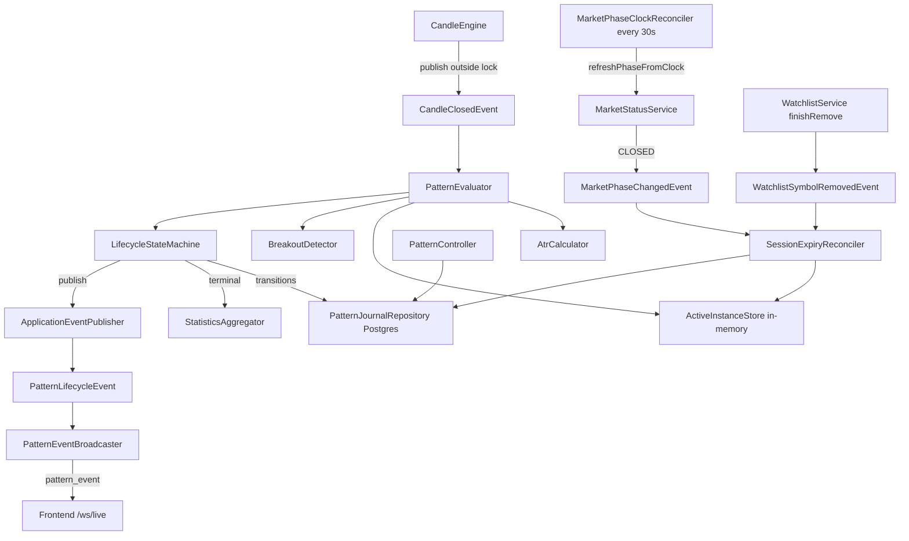
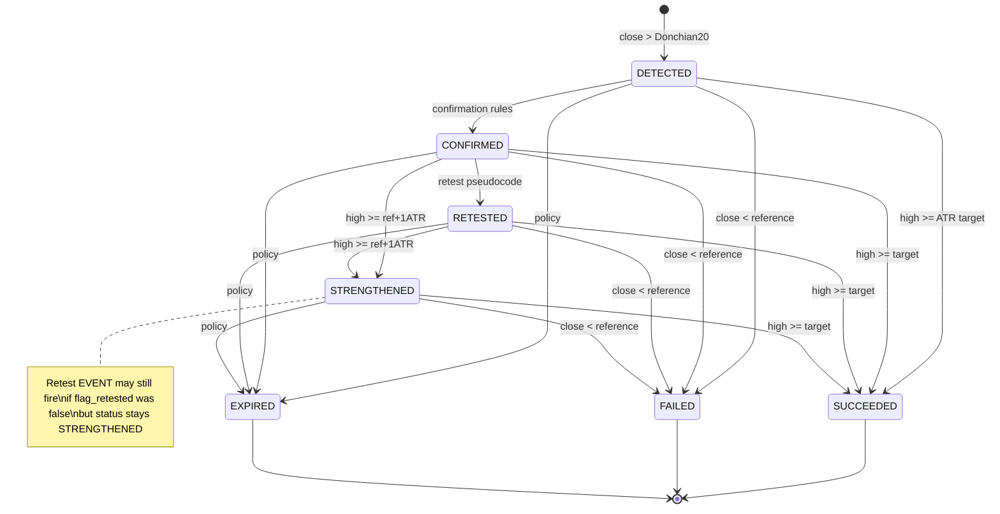
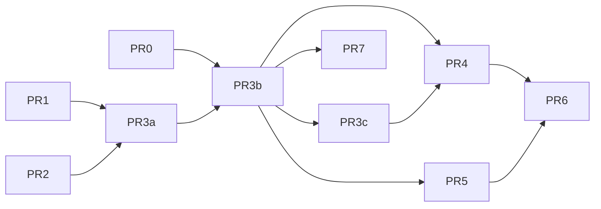

# Pattern Intelligence (MVP) — Design Document

| Field | Value |
|---|---|
| **Document** | Pattern Intelligence Design v1.0 |
| **Author** | TBD |
| **Date** | 2026-07-13 |
| **Status** | Approved (rev 3 — design-review consensus, 0 open issues) |
| **Repo publish path** | `Pattern-Intelligence-Design-v1.0.md` (repo root) |
| **Related** | `Pattern-Definitions-v1.0-Final.md`, `Architecture-Design-v1.0.md` §9.3–9.4, `Data-Flow-and-Frontend-API-Spec-v1.0.md`, `Implementation-Plan-v1.0.md` Phase 4–8, `Architectural-Decisions.md` (AD0, KD27, KD28), `Multi-Symbol-Watchlist-Design-v1.0.md` |

**Scope note vs Pattern-Definitions / Implementation Plan:** Pattern-Definitions and Implementation Plan Phase 5–6 describe a four-detector “MVP 1” set (Breakout, Breakdown, Consolidation, Volume Breakout) and pair Breakout+Breakdown in one phase. **This document supersedes that pairing for delivery sequencing:** implement a **Breakout vertical first** (full journal + APIs + WS). Breakdown is a later mirror PR; Consolidation and Volume Breakout remain multi-PR follow-ons. Rules for Breakout itself still come from Pattern-Definitions except where **Divergence from Pattern-Definitions** (below) product-locks intentional changes.

---

## Overview

TIP already builds multi-timeframe candles in memory (`CandleEngine`), streams them over `/ws/live`, and persists a soft-delete-capable watchlist in Postgres (`watchlist_symbols`, Flyway `V1`). Pattern Intelligence is the next vertical: on each **closed** candle, detect and track **Breakout** setups through a full non-repainting lifecycle, journal every transition and terminal outcome in Postgres, aggregate gated statistics, and push `pattern_event` messages for chart overlays and an alerts feed.

This MVP implements **Breakout only**, on **live-forward** closed bars (no historical backfill). Pattern state is Postgres-only: the **default** app config is `tip.watchlist.store=memory` (no JDBC), so patterns are **off until** `TIP_WATCHLIST_STORE=postgres` (and a live DB). Shared detector interfaces and a direction-aware lifecycle state machine allow **Breakdown** as a later mirror PR without schema rework. No order execution (AD0) — outcomes are **virtual trades** measured in R / ATR units.

**Critical runtime constraints (rev 3):**

1. `CandleClosedEvent` must be published **outside** the `CandleEngine` per-series lock; pattern evaluation must never hold that lock or run DB/WS work under it.
2. Session-close expiry applies only to **intraday** timeframes; higher TFs use max-session / max-candle policies.
3. Instance `status` = terminal if closed, else **highest enrichment ordinal** (flags); never demote STRENGTHENED → RETESTED.
4. **Startup (PI-15):** expire only session_close TF opens (`1m`/`5m`/`15m`); **hydrate** open `1h`/`4h`/`1d` and resume (MFE/MAE recompute from closed candles).
5. **`@EnableScheduling`** required for phase clock (PR0 `SchedulingConfig`).

---

## Background & Motivation

### Current state (grounded in code)

| Area | Reality |
|---|---|
| Candles | In-memory only in `com.tip.market.CandleEngine`; keyed `instrumentKey\|timeframe` |
| Close signal | `CandleClosedEvent(instrumentKey, timeframe, Candle)` published from `closeCurrentCandle` — **today inside `synchronized (state)`** (must change; see Eval threading) |
| Closed series API | `getAllCandles` **includes** in-progress `currentCandle` when present — **not safe** as sole lookback source; need `getClosedCandles` |
| Market session | `MarketStatusService` + `NseMarketClock` (09:15–15:30 IST weekdays); `MarketPhaseChangedEvent` on phase change. **`refreshPhaseFromClock()` is only called from bootstrap** (`MarketBootstrapService.recoverAllActive`), **not on a schedule** — patterns must add a scheduled clock reconciler |
| Watchlist | Cap 50; Postgres soft-delete (`removed_at`, `is_active`) for journal joins (KD27); **YAML default `tip.watchlist.store=memory`** disables JDBC/Flyway via `WatchlistStoreEnvironmentPostProcessor` |
| Timeframes | `1m, 5m, 15m, 1h, 4h, 1d` → worst case **50 × 6 = 300** series |
| Patterns | Not implemented; Architecture §9.4 and Data-Flow REST/WS shapes are planned only |
| Index volume | Seed includes `NSE_INDEX\|Nifty 50`; candle volume often 0 / unusable for volume confirmation |
| Metrics libs | No Micrometer/Actuator on classpath today — MVP uses structured logs |

Architecture §8 status table is partially stale (watchlist, multi-TF, Postgres watchlist already exist). This design extends the **current** Spring Boot backend, not the original Node/Dhan plan.

### Pain points this solves

1. No durable record of breakout setups as they form and resolve.
2. No objective outcome metrics (win rate alone is misleading; need MFE/MAE in R).
3. No real-time lifecycle feed for overlays/alerts.
4. Open setups would grow unbounded without TF-aware abandonment.

### Industry patterns incorporated

1. **Event-sourced lifecycle journal** — instance + append-only events + terminal outcome.
2. **Non-repainting detection** — close-only evaluation (TradingView / LuxAlgo style).
3. **Outcome beyond win rate** — MFE/MAE, signed move in R, duration.
4. **Frozen reference levels** at Detected — later bars do not recompute rails for an open instance.
5. **Virtual trade framework** — entry/stop/target tracked without orders (AD0).
6. **Gated statistics** — no rates until `sample_size >= 20`.
7. **Abandonment / invalidation** — TF-scoped expiry so open inventory stays bounded.

---

## Goals & Non-Goals

### Goals

1. Detect **Breakout** on closed candles per Pattern-Definitions (Donchian-20 high; Consolidation-linked reference deferred), plus product-locked divergences below.
2. Track full lifecycle: **Detected → Confirmed → Retested → Strengthened → Succeeded | Failed | Expired** (enrichment flags; see status model).
3. Persist `pattern_instances`, `pattern_events`, `pattern_outcomes`, `pattern_statistics` in Postgres.
4. Expose REST per Data-Flow: patterns list + gated statistics (with inventory + performance rates).
5. Broadcast configurable `pattern_event` stages over `/ws/live` (default: all stages).
6. **TF-scoped expiry**: session-end for intraday TFs; max-sessions / max-candles for higher TFs (PI-19).
7. Keep eval cost modest: O(lookback) per close, max ~300 series; **never under CandleEngine lock**.
8. Package and config under `com.tip.pattern` / `tip.pattern.*` with feature flag.
9. Design interfaces so Breakdown is a thin mirror PR later.
10. Prerequisite infra: publish-outside-lock + scheduled phase clock + `getClosedCandles` + `WatchlistSymbolRemovedEvent`.

### Non-Goals (MVP)

- Consolidation, Volume Breakout, Higher High / Lower Low detectors (full four-detector set is multi-PR; this doc is Breakout vertical first).
- Pairing Breakout+Breakdown in one delivery phase (supersedes Implementation Plan Phase 5 bundling).
- Historical backfill / offline backtest harness (future).
- Order execution, broker OMS, position sizing.
- Pattern persistence in memory watchlist mode.
- Frontend chart markers/overlays as a hard deliverable of backend PRs (APIs fully specified; FE is a later PR).
- Expectancy / Kelly / advanced regime filters.
- Multi-user auth; `users` settings table (still later).
- Micrometer/Actuator dependency (structured logs only for MVP).

---

## Key Decisions

| ID | Decision | Rationale |
|---|---|---|
| **PI-1** | MVP detector = **Breakout only**; shared `PatternDetector` + direction enum for Breakdown later | Locked scope; avoids half-built Consolidation coupling |
| **PI-2** | Evaluate **only** on `CandleClosedEvent` | Non-repainting journal; matches locked decision |
| **PI-3** | Pattern journal = **Postgres only**; memory store → patterns **disabled** | No dual journal; aligns with DB-off memory profile. **Requires** `TIP_WATCHLIST_STORE=postgres` + DB to enable |
| **PI-4** | **Live-forward only** — seed candles never produce pattern events | Simpler correctness; backtest harness later |
| **PI-5** | **Multiple concurrent** open Breakouts per symbol × TF allowed | Locked; real markets can produce sequential level breaks |
| **PI-6** | Anti-spam **single rule**: open new Detected iff `close > ref && ref > maxOpenRef`, where `maxOpenRef = max(open.reference_level)` or **−∞** if no open BREAKOUT on that symbol×TF | One boolean; uses frozen stored levels only; no `==` equality path |
| **PI-7** | **Product-locked success targets:** with retest → `reference + 2×(reference − retest_floor)` when `retest_floor < reference`; without retest → `reference + 2× atr_at_detect`. Momentum can **Succeed on ATR target before any retest** | Unbounded opens without a target; ATR is volatility-scaled. **Diverges from Pattern-Definitions** (see dedicated subsection) |
| **PI-8** | R-unit for MFE/MAE/move = **`atr_at_detect`** | Stable denominator; avoids near-zero R when entry hugs the level |
| **PI-9** | MFE/MAE from **closed-bar high/low** (not tick stream) | Eval is close-driven; OHLC extremes acceptable for MVP |
| **PI-10** | Stats gate **`sample_size >= 20`** (inventory count of all terminals) | Locked (overrides Implementation Plan’s 30) |
| **PI-11** | Expiry delivery: **`MarketPhaseChangedEvent(CLOSED)`** + **mandatory scheduled** `refreshPhaseFromClock` every **30s**; startup orphan expire; symbol-remove expire | Feed alone is insufficient if stuck OPEN |
| **PI-12** | Volume unusable (INDEX segment **or** avg volume ≤ 0 **or** breakout volume ≤ 0) → confirmation **close-only** even if config is `both` | Auto-fallback for Nifty index / zero VTT |
| **PI-13** | WS stages configurable via `tip.pattern.ws.broadcast-stages` (default **all** stages including Retested/Strengthened/Expired); journal always records all stages | Locked “all stages” product default; still allows Plan-style subset without code change |
| **PI-14** | `symbol_id` = Upstox `instrument_key` (watchlist PK) | Soft-delete joins (KD27); consistent APIs |
| **PI-15** | **TF-scoped startup recovery:** expire open instances only for **session_close** TFs (`1m,5m,15m`) with `reason=startup_recovery`. For **`1h`/`4h`/`1d`**, **hydrate** open rows into `ActiveInstanceStore` and resume lifecycle — do **not** mass-expire multi-day opens on restart | Makes PI-19 multi-day policies survive deploys/crashes; short intraday still clean-slate |
| **PI-16** | Confirmation modes: `close` \| `volume` \| `both` (default `both`) | Matches Pattern-Definitions |
| **PI-17** | Virtual entry = **Detected candle close**; stop = **reference_level**; target from PI-7 | Read-only virtual trade (AD0) |
| **PI-18** | `detector_version` string on instance | Threshold changes remain journal-comparable |
| **PI-19** | **TF-scoped expiry policy** (table below) | Session-close on 1d would poison stats and kill multi-day setups |
| **PI-20** | **Eval concurrency:** (1) `CandleEngine` publishes `CandleClosedEvent` **outside** `synchronized(state)`; (2) pattern work never holds engine lock; (3) at most one evaluator task per `symbolId\|timeframe` (serialize on that key); DB/WS only in evaluator path after unlock | Prevents tick stall and lock-held I/O |
| **PI-21** | Same-bar terminal priority: **Failed before Succeeded** | Invalidation dominates target touch on same close |
| **PI-22** | Display `status` = terminal if any; else **highest ordinal among flags** `STRENGTHENED > RETESTED > CONFIRMED > DETECTED`. Retest **event** after strengthen allowed; **status never demotes** | Deterministic REST/WS; event log remains complete |
| **PI-23** | When expiring with incomplete excursions (`startup_recovery` for session_close TFs, or memory empty): outcome excursion fields **NULL**; **exclude** from avg means. Hydrated multi-day instances **recompute** MFE/MAE best-effort from `getClosedCandles` since `detect_candle_time` | Do not poison stats with zeros; multi-day keeps excursion tracking after restart |
| **PI-24** | Patterns disabled REST → **HTTP 503** + `{ "error": "patterns_disabled" }` | Explicit; not empty 200 that looks healthy |
| **PI-25** | Detector registration = list of Spring beans implementing `PatternDetector`; MVP registers **only** `BreakoutDetector` | Avoid hardcoding type switches for Breakdown later |
| **PI-26** | Stats performance rate **`resolved_success_rate`** excludes expired; inventory `success_rate` = success/sample_size kept for honesty | Win rate usable when expiry is common |
| **PI-27** | `WatchlistSymbolRemovedEvent(symbolId)` from `WatchlistService.finishRemove` after candle/feed cleanup, before return; pattern package listens (no reverse dep) | Clean coupling |
| **PI-28** | Lookback via **`CandleEngine.getClosedCandles`** only | Avoids in-progress contamination from `getAllCandles` |

### PI-19 — Expiry policy by timeframe

| Timeframe | Expiry mode | Rule |
|---|---|---|
| `1m`, `5m`, `15m` | **session_close** | On transition to `MarketPhase.CLOSED`, expire all open instances for these TFs with `reason=session_end` |
| `1h` | **max_sessions + max_candles** (same style as 4h) | Do **not** session-expire daily. Expire when `sessions_seen ≥ max-sessions-1h` (default **5**) or `duration_candles ≥ max-candles-1h` (default **60**) — whichever first. Hydrate on restart |
| `4h` | **max_sessions + max_candles** | Do **not** session-expire daily. Expire when `sessions_seen ≥ max-sessions-4h` (default **5**) or `duration_candles ≥ max-candles-4h` (default **60**) — whichever first |
| `1d` | **max_candles only** | **Never** session-expire on daily market close. Expire when `duration_candles ≥ tip.pattern.expiry.max-candles-1d` (default **30** daily bars) without terminal price outcome |

Config keys under `tip.pattern.expiry.*` (see Config section).

### PI-15 — Startup recovery (product-locked with PI-19)

| Timeframe class | On `ApplicationReady` / pattern engine start |
|---|---|
| **session_close** (`1m`, `5m`, `15m`) | Load open rows → terminal **EXPIRED** `reason=startup_recovery`, excursion fields **NULL** → do **not** put in `ActiveInstanceStore` |
| **multi-day** (`1h`, `4h`, `1d`) | **Hydrate** each open row into `ActiveInstanceStore`; **do not** expire; resume on subsequent `CandleClosedEvent`s |

**Hydrate field set** (from `pattern_instances` row → `ActivePattern`):

| Field | Source |
|---|---|
| `id`, `symbol_id`, `pattern_type`, `timeframe`, `direction` | DB |
| `status`, `flag_confirmed`, `flag_retested`, `flag_strengthened` | DB |
| `reference_level`, `lookback_high`, `atr_at_detect`, `volume_at_detect` | DB (frozen rails) |
| `volume_ok_at_detect`, `confirmation_mode_used` | DB |
| `entry_price`, `stop_level`, `target_level`, `retest_floor` | DB |
| `detect_candle_time`, `detected_at`, `confirmed_at` | DB |
| `sessions_seen` | DB (4h policy counter) |
| `detector_version` | DB |
| `mfePrice` / `maePrice` | **Best-effort recompute** (below), not left permanently unset |

**MFE/MAE recompute on hydrate (preferred):**

```text
closed = candleEngine.getClosedCandles(symbolId, timeframe)
// bars at or after detect_candle_time (inclusive of detect bar if still in memory)
window = [c in closed where c.time >= instance.detect_candle_time]
if window empty:
  mfePrice = entry_price; maePrice = entry_price   // neutral seed; refine on next closes
else:
  mfePrice = max(c.high for c in window)
  maePrice = min(c.low for c in window)
durationCandlesHint = window.size()  // used for max-candles checks until live counter advances
```

Notes:

- Seed lookback may not retain the full path since detect (memory series). Recompute is **best-effort** from whatever closed bars remain after bootstrap; subsequent live closes continue updating MFE/MAE.
- Do **not** invent excursion statistics beyond OHLC of available closed candles.
- If symbol is no longer on watchlist / has no candle series, expire that multi-day instance with `reason=symbol_removed` or `startup_recovery` (prefer `symbol_removed` if soft-deleted inactive; else leave hydrated only when series exists).
- `sessions_seen` is **not** reset on hydrate; session-close reconciler continues incrementing for open 4h instances.

### Divergence from Pattern-Definitions (product-locked)

| Topic | Pattern-Definitions | This design (locked) |
|---|---|---|
| Succeeded | “2× the distance from the breakout level to the **retest floor**” | Same **when retest has set** `retest_floor < reference`. **Without retest:** Succeed when high ≥ `reference + 2 × atr_at_detect` |
| Momentum path | Implies success after retest geometry | **Allowed:** Strengthened-only (or Confirmed-only) path may hit ATR target and **Succeed before any Retested event** |
| Reference source | Donchian-20 **or** Consolidation top | MVP: **Donchian-20 only** (Consolidation deferred) |
| Detector set | Four detectors in “MVP 1” | Delivery: **Breakout vertical first**; others later PRs |

Rationale: without a no-retest target, many breakouts never retest and would only Fail or Expire — biasing stats and leaving inventory open for days on higher TFs. ATR multiple matches the doc’s volatility yardstick. Thresholds remain config-tunable (`success-atr-mult-without-retest`).

---

## Proposed Design

### High-level architecture



### Eval threading & CandleEngine contract (PI-20) — **required prerequisite**

**Problem today:** `CandleEngine.processTick` holds `synchronized (state)` while calling `closeCurrentCandle`, which publishes `CandleClosedEvent` (and `CandleUpdatedEvent`) **inside** the lock. Spring `@EventListener` is synchronous. Pattern evaluation with Postgres would block that series’ ticks for the duration of DB I/O. Existing `LiveCandleBroadcaster` already does WS work under the same lock — **must not be extended**; pattern work must not join that path.

**Required `CandleEngine` change (PR0 / PR3a dependency):**

```text
// Pseudocode — closeCurrentCandle / processTick boundary
synchronized (state) {
    // mutate closedCandles / currentCandle only
    closed = ...; // snapshot Candle value (immutable record)
    // do NOT publish here
}
// outside lock:
eventPublisher.publishEvent(new CandleClosedEvent(key, tf, closed));
eventPublisher.publishEvent(new CandleUpdatedEvent(..., isFinal=true));
```

Same for any other close path. **Invariant:** no `publishEvent` while holding `SymbolState` monitor.

**Pattern evaluation model (chosen default):**

| Option | Choice |
|---|---|
| A. Same thread after unlock, no DB under lock | **Allowed** for MVP if publish is outside lock — listener still runs on feed thread |
| B. Dedicated executor, single-thread **per key** (or global single worker with per-key queue) | **Preferred** if eval latency observed; optional in same PR if A is too hot |

**MVP mandate:**

1. Publish-outside-lock is **blocking** for merge of pattern evaluator.
2. `PatternEvaluator` must not call into `CandleEngine` methods that re-enter the same lock in a way that deadlocks; it only reads via `getClosedCandles` (brief lock, copy-out list, return).
3. **At most one concurrent eval** per `symbolId|timeframe`: `ActiveInstanceStore` / evaluator synchronizes on that key string (or uses a striped lock). Cross-key parallelism OK.
4. **Ban:** DB transactions, WS broadcast, or long ATR loops while holding `CandleEngine` state lock.
5. Stats + outcome writes share one `@Transactional` boundary; no requirement for async DB.

If feed-thread latency becomes an issue, promote to a single-thread executor with ordered tasks per key (document as follow-up; interface `PatternEvaluationScheduler` can wrap either).

### Evaluation sequence (per closed candle)

```mermaid
sequenceDiagram
    participant CE as CandleEngine
    participant PE as PatternEvaluator
    participant ATR as AtrCalculator
    participant AWS as ActiveInstanceStore
    participant SM as LifecycleStateMachine
    participant DB as Postgres
    participant WS as PatternEventBroadcaster

    Note over CE: mutate under lock; publish outside lock
    CE->>PE: CandleClosedEvent(symbol, tf, candle)
    PE->>PE: if !PatternFeatureGuard.enabled → return
    PE->>PE: synchronize on symbol|tf
    PE->>CE: getClosedCandles(symbol, tf) copy-out
    PE->>ATR: ATR(14), Donchian high(20), avgVol(20)
    PE->>AWS: list open instances (symbol, tf)
    loop each open instance
        PE->>SM: advance(instance, candle, indicators)
        SM->>DB: single TX: N events + instance update + optional outcome/stats
        SM->>WS: PatternLifecycleEvent per new stage (if in broadcast-stages)
    end
    PE->>PE: tryDetect new Breakout (PI-6)
    opt new Detected
        PE->>DB: INSERT instance + Detected event
        PE->>AWS: put active
        PE->>WS: pattern_event detected
    end
```

### Package layout

```
com.tip.pattern
├── PatternProperties.java
├── PatternConfig.java
├── PatternFeatureGuard.java            # enabled && store==postgres
├── model
│   ├── PatternType.java                # BREAKOUT, BREAKDOWN (enum)
│   ├── PatternDirection.java           # LONG, SHORT
│   ├── PatternStatus.java              # DETECTED…EXPIRED
│   ├── PatternEventType.java
│   ├── FinalOutcome.java
│   ├── ConfirmationMode.java
│   ├── PatternInstance.java            # includes flag booleans
│   ├── PatternEvent.java
│   ├── PatternOutcome.java             # nullable MFE/MAE fields
│   └── PatternStatistics.java
├── indicator
│   ├── AtrCalculator.java
│   ├── DonchianCalculator.java
│   └── VolumeStats.java
├── detector
│   ├── PatternDetector.java
│   ├── DetectionContext.java
│   ├── DetectionSignal.java
│   └── BreakoutDetector.java           # only registered MVP bean
├── lifecycle
│   ├── LifecycleStateMachine.java
│   ├── TransitionBatch.java            # 0..N events + final status + optional terminal
│   └── VirtualTradeLevels.java
├── engine
│   ├── PatternEvaluator.java
│   ├── ActiveInstanceStore.java
│   ├── SessionExpiryReconciler.java    # phase CLOSED + max-sessions/candles
│   ├── PatternStartupReconciler.java
│   └── WatchlistRemovePatternListener.java
├── persistence
│   ├── ...Entity / JpaRepository (postgres only)
│   ├── PatternJournalRepository.java   # interface
│   ├── PostgresPatternJournalRepository.java
│   └── NoOpPatternJournalRepository.java
├── service
│   ├── PatternQueryService.java
│   └── StatisticsService.java
├── api
│   ├── PatternController.java
│   └── dto...
└── websocket
    └── PatternEventBroadcaster.java

com.tip.market (touch points)
├── CandleEngine.java                   # publish-outside-lock; getClosedCandles
└── MarketPhaseClockReconciler.java     # @Scheduled refreshPhaseFromClock every 30s

com.tip.watchlist (touch points)
├── WatchlistService.java               # publish WatchlistSymbolRemovedEvent
└── event/WatchlistSymbolRemovedEvent.java
```

### Bean matrix (store × enabled)

| `tip.watchlist.store` | `tip.pattern.enabled` | DataSource/JPA | Journal bean | Evaluator | REST |
|---|---|---|---|---|---|
| `memory` (default YAML) | `*` | **Absent** (EnvironmentPostProcessor) | `NoOpPatternJournalRepository` | Present; **no-op** via guard | **503** `patterns_disabled` |
| `postgres` | `false` | Present | Postgres impl | Present; no-op | **503** |
| `postgres` | `true` (default) | Present | Postgres impl | Active | 200 |

**Rules:**

- Key off **effective** `tip.watchlist.store` (not `matchIfMissing` alone). YAML default is `memory`; postgres repo conditionals on watchlist use store property — pattern code must mirror that.
- Never inject JPA repositories into always-on evaluator; only `PatternJournalRepository` interface.
- `MemoryStoreContextLoadTest` must continue to pass with pattern classes on classpath (NoOp + guard).

**Enabling patterns locally:**

```text
TIP_WATCHLIST_STORE=postgres
SPRING_DATASOURCE_URL=jdbc:postgresql://localhost:5432/tip
# + credentials; Flyway runs V1+V2
```

### Indicator computation & closed-candle API (PI-28)

**Add** to `CandleEngine`:

```java
/**
 * Snapshot of fully closed candles only (excludes in-progress currentCandle).
 * Copy-out under state lock; safe for callers to retain the list.
 */
public List<Candle> getClosedCandles(String instrumentKey, String timeframe);
```

**Algorithm:** under lock, return `List.copyOf(state.closedCandles)` (or unmodifiable copy). Do **not** append `currentCandle`.

**Evaluator lookback:**

1. Signal candle = `event.candle()` (authoritative just-closed bar).
2. `closed = candleEngine.getClosedCandles(symbol, tf)`.
3. Ensure signal is represented: if `closed` is empty or `closed.last.time < signal.time`, treat prior series as `closed` and signal separately; if `closed.last.time == signal.time`, use `closed` as full series ending at signal; if `closed.last.time > signal.time`, log warn and skip eval (clock skew / race — should not happen if publish is after append).
4. Donchian/ATR/avgVol use bars **strictly before** signal for lookback windows; ATR may include signal bar’s TR as is standard for “ATR at this close” — **MVP: compute ATR on series ending at signal (inclusive)**; Donchian reference = max high of the **20 bars immediately before signal**.

Unit tests must cover seed-overlap path where current bar replaces last seed timestamp (`CandleEngine` lines that replace same-time bar) so `getClosedCandles` never includes a live in-progress bar.

| Indicator | Rule | Minimum bars |
|---|---|---|
| ATR(14) | Wilder RMA of true range; period 14; series ending at signal | 15 closes |
| Donchian reference high | `max(high)` of prior 20 closed candles **excluding** signal | 21 closes total |
| Avg volume (20) | SMA of volume of prior 20 excluding signal | 20 prior |

If insufficient bars → skip **new detection**; still advance open instances (frozen levels only need price).

### Breakout detector rules

Reference level (MVP): **Donchian-20 high** of prior 20 bars.

| Stage | Rule (long / Breakout) |
|---|---|
| **Detected** | `close > reference_level`. Freeze `reference_level`, `lookback_high`, `atr_at_detect`, `volume_at_detect`, `entry_price=close`, `stop_level=reference`, `target_level=reference+2*atr_at_detect`, flags all false, `volume_ok_at_detect` as computed. |
| **Confirmed** | Effective confirmation mode (below). Sets `flag_confirmed=true`. |
| **Retested** | See pseudocode. Sets `flag_retested=true`; may update `retest_floor` / `target_level`. |
| **Strengthened** | After confirmed: `high >= reference + strengthenAtrMult * atr_at_detect` and not failed. Sets `flag_strengthened=true`. |
| **Succeeded** | `high >= target_level`. Terminal. **May occur without retest** (PI-7). |
| **Failed** | `close < reference_level`. Terminal. |
| **Expired** | Policy engine (session / max-sessions / max-candles / startup / remove). Terminal. |

**Confirmation mode** (`tip.pattern.breakout.confirmation-mode`, default `both`):

| Mode | Effective rule |
|---|---|
| `close` | A **later** closed candle has `close > reference_level` |
| `volume` | Detected candle volume ≥ `1.5 ×` avgVol20 → Confirmed on same eval pass after Detected |
| `both` | `volume_ok_at_detect` true **and** a later close still `close > reference` |

**Volume auto-fallback (PI-12):**

```
volumeUnusable =
    segment == "NSE_INDEX"
    OR avgVolume20 <= 0
    OR breakoutCandle.volume <= 0

if volumeUnusable && mode in (volume, both):
    effectiveMode = close
    confirmation_mode_used = "close_fallback"
else:
    confirmation_mode_used = configured mode name
```

Persist `volume_ok_at_detect` (boolean) and `confirmation_mode_used` on the instance row (needed for hydrate of multi-day opens and mid-session debug).

#### Confirmation + lifecycle — pseudocode

**`Succeeded` may terminal from DETECTED without Confirmed** if `high >= target_level` (PI-7 ATR target path + PI-21 order: Failed first, then Succeeded, then non-terminal enrichments). Do not “fix” this by requiring Confirmed before Succeeded.

```text
// confirmation_mode_used is frozen on the instance at Detected
// ("close" | "volume" | "both" | "close_fallback")
// volume_ok_at_detect set at Detected from breakout-bar volume vs avgVol20
//   (false when mode became close_fallback or volume condition failed)

function isDetectBar(instance, candle):
  return candle.time == instance.detect_candle_time

function canConfirm(instance, candle):
  mode = instance.confirmation_mode_used
  stillAbove = candle.close > instance.reference_level
  if not stillAbove:
    return false
  if mode == "volume":
    // Pure volume: confirm on detect bar only (same eval pass as Detected)
    return instance.volume_ok_at_detect && isDetectBar(instance, candle)
  if mode == "close" || mode == "close_fallback":
    // close_fallback ignores volume_ok; requires a later bar still above
    return not isDetectBar(instance, candle)
  if mode == "both":
    // volume already satisfied at detect; close confirmation on a later bar
    return instance.volume_ok_at_detect && not isDetectBar(instance, candle)
  return false

function onCandle(instance, candle, atr):  // atr = instance.atr_at_detect
  ref = instance.reference_level
  // 1) MFE/MAE memory
  instance.mfePrice = max(instance.mfePrice, candle.high)
  instance.maePrice = min(instance.maePrice, candle.low)

  // 2) Terminal: Failed first (PI-21)
  if candle.close < ref:
    return terminal(FAILED, reason=invalidation)

  // 3) Terminal: Succeeded — allowed from DETECTED (no Confirmed required)
  if candle.high >= instance.target_level:
    return terminal(SUCCEEDED, reason=price_target)

  events = []

  // 4) Confirmed
  if !instance.flag_confirmed && canConfirm(instance, candle):
    instance.flag_confirmed = true
    instance.confirmed_at = now()
    events += CONFIRMED

  // 5) Retested (only once; allowed even if already strengthened)
  if instance.flag_confirmed && !instance.flag_retested:
    retestBand = ref + 0.25 * atr
    // Pullback into band without closing below ref (close already >= ref from fail check)
    if candle.low <= retestBand && candle.close >= ref:
      instance.flag_retested = true
      // retest_floor = low of this bar (first retest only)
      instance.retest_floor = candle.low
      if instance.retest_floor < ref:
        // measured move 2R from retest depth
        risk = ref - instance.retest_floor
        instance.target_level = ref + 2.0 * risk
      // else: wick never went below ref — keep ATR fallback target
      events += RETESTED

  // 6) Strengthened (only once; independent of retested)
  if instance.flag_confirmed && !instance.flag_strengthened:
    if candle.high >= ref + 1.0 * atr:
      instance.flag_strengthened = true
      events += STRENGTHENED

  instance.status = displayStatus(instance)  // highest ordinal flags; no demotion
  return events  // 0..N non-terminal events same bar
```

**Same-bar multi-stage:** e.g. Confirmed + Strengthened → insert **two** `pattern_events` in order, one instance update, one `@Transactional` commit, two WS messages if configured. Status column = highest ordinal among flags (`STRENGTHENED` if both).

**Detect-bar volume path:** After creating Detected in the same evaluation, if `confirmation_mode_used == "volume"` and `volume_ok_at_detect`, immediately run `onCandle` (or only the confirm branch) so Detected+Confirmed can emit on one bar. Succeeded on that same bar is still possible if `high >= target` (checked before confirm in `onCandle` order — if target already hit on breakout bar, terminal Succeeded without Confirmed event).

### Lifecycle state machine (PI-22)



**No edge STRENGTHENED → RETESTED for status.** If retest conditions fire after strengthen and `flag_retested` was false: append `RETESTED` event, set flag, **keep `status=STRENGTHENED`**.

**Display status function:**

```text
if terminal: return SUCCEEDED|FAILED|EXPIRED
if flag_strengthened: return STRENGTHENED
if flag_retested: return RETESTED
if flag_confirmed: return CONFIRMED
return DETECTED
```

DB columns: `status` TEXT plus `flag_confirmed`, `flag_retested`, `flag_strengthened` booleans (default false).

### Multi-instance concurrency (PI-5, PI-6)

Single condition for new Detected of type BREAKOUT on `(symbol_id, timeframe)`:

```text
ref = donchianHigh(prior 20)
maxOpenRef = max(i.reference_level for i in openBreakouts(symbol, tf))
             or NegativeInfinity if none

openNew = (close > ref) && indicatorsOk && (ref > maxOpenRef)
```

Compare against **frozen** `reference_level` values stored on open instances (never recompute their rails for anti-spam). When all opens at/above a plateau resolve, a later equal `ref` may detect again (`maxOpenRef` drops).

### Virtual trade & outcomes

| Field | Rule |
|---|---|
| `entry_price` | Detected candle close |
| `stop_level` | `reference_level` |
| `target_level` | PI-7 |
| MFE/MAE prices | Running max high / min low on closed bars since detect (memory while open) |
| `max_favorable_r` / `max_adverse_r` | vs entry / `atr_at_detect`; **NULL** if unknown (startup recovery) |
| `move_r` | `(end_price - entry) / atr_at_detect`; **NULL** if end price unknown |
| `end_price` | Terminal candle close when price-driven; for expiry may be last known close or NULL if never evaluated |
| `duration_candles` | Detect candle through terminal inclusive when known; else estimated from timestamps / 0 with reason |
| `duration_seconds` | `ended_at - detected_at` |

**Running MFE/MAE:** held on `ActivePattern` during life (recomputed on hydrate for multi-day; then updated per close); written to `pattern_outcomes` at terminal when available. Not required as DB columns for MVP (recompute from closed candles is enough).

**Expired outcome rules (PI-23):**

| `reason` | MFE/MAE / move_r / end_price | Include in avg_mfe/mae/move |
|---|---|---|
| `session_end` | From memory if instance was active in this process; else NULL | Only if non-NULL |
| `max_sessions` / `max_candles` | From memory (incl. after hydrate + recompute) | Yes if non-NULL |
| `startup_recovery` | **Only session_close TFs** on process start: all excursion fields **NULL**; `end_price` NULL | **No** |
| `symbol_removed` | From memory if active; else NULL | Only if non-NULL |

### In-memory working set vs Postgres

| Concern | Approach |
|---|---|
| Active instances | `ActiveInstanceStore`: map key `symbolId\|timeframe` → list of `ActivePattern` (includes flags, mfe/mae, volume_ok, sessions_seen) |
| Writes | Transactional journal then memory |
| Startup | `PatternStartupReconciler` (PI-15): **expire** open rows for session_close TFs only (`startup_recovery`, NULL excursions); **hydrate** open `4h`/`1d` into store + MFE/MAE recompute from `getClosedCandles` |
| Crash mid-session | Intraday opens discarded via startup expire; multi-day opens resume via hydrate |
| Watchlist remove | Listen `WatchlistSymbolRemovedEvent` → expire open for `symbolId` with `reason=symbol_removed` + WS + stats |
| Seed | `seed()` must not publish `CandleClosedEvent` (already true — keep); hydrate runs **after** bootstrap seed so closed series is available for recompute |

### Watchlist remove contract (PI-27)

```text
WatchlistService.finishRemove(symbolId):
  unsubscribe feed
  candleEngine.evict(symbolId)
  broadcaster.evictThrottleKeys / notifySymbolRemoved  // existing
  repository soft-delete (postgres) or hard-delete (memory)
  eventPublisher.publishEvent(new WatchlistSymbolRemovedEvent(symbolId))  // AFTER cleanup
  return
```

`WatchlistRemovePatternListener` in `com.tip.pattern.engine` handles expiry. Pattern package depends on watchlist **event type** only; `WatchlistService` does **not** depend on pattern.

Memory mode: patterns disabled — listener no-ops; hard-delete N/A for journal.

### Session-end & policy expiry (PI-11, PI-19)

```mermaid
sequenceDiagram
    participant CLK as MarketPhaseClockReconciler
    participant MS as MarketStatusService
    participant EXP as SessionExpiryReconciler
    participant AWS as ActiveInstanceStore
    participant DB as Postgres

    CLK->>MS: refreshPhaseFromClock() every 30s
    MS->>EXP: MarketPhaseChangedEvent(CLOSED) if phase changed
    Note over EXP: previous was OPEN or PRE_OPEN only
    EXP->>AWS: open instances with TF in session_close set
    loop those instances
        EXP->>DB: EXPIRED session_end + outcome + stats
    end
    Note over EXP: separately on each eval or daily job
    EXP->>EXP: max_sessions for 4h; max_candles for 4h/1d
```

**Mandatory `MarketPhaseClockReconciler` + scheduling enablement:**

- Class: `com.tip.market.MarketPhaseClockReconciler` (market package — runs even when patterns disabled).
- `@Scheduled(fixedRateString = "${tip.market.phase-refresh-ms:30000}")` → `marketStatusService.refreshPhaseFromClock()`.
- **PR0 must add `@EnableScheduling`** on a dedicated config bean, e.g. `com.tip.config.SchedulingConfig` annotated with `@Configuration` + `@EnableScheduling` (preferred over main application class so tests can isolate). TIP currently has **no** `@EnableScheduling`; without it the reconciler is inert and stuck-OPEN never expires.
- Coexists with feed-driven phase updates (last writer wins via `setMarketPhase` equality check).
- Tests: (1) context loads with scheduling enabled / scheduled method invocable; (2) forced tick calls `refreshPhaseFromClock`; (3) stuck OPEN with clock past 15:30 → CLOSED event → intraday patterns expire.
- Optional alias: `tip.pattern.expiry.phase-refresh-ms` may document the same interval but **binding is `tip.market.phase-refresh-ms`** so market infra owns the clock.

**4h max sessions:** count `MarketPhase` transitions into CLOSED while instance open (or count distinct IST trading dates with CLOSE after detect). MVP simple approach: `sessions_seen` counter on `ActivePattern` incremented on each session_end reconciler pass for open 4h instances; at ≥ 5 → expire that instance (without expiring 4h on first close).

**1d:** only `duration_candles` / max-candles check on each daily close evaluation.

### Statistics aggregation (PI-10, PI-26)

On each terminal outcome, in **same transaction** as outcome insert:

```text
SELECT ... FROM pattern_statistics WHERE ... FOR UPDATE  -- create row if missing
sample_size += 1
success_count / fail_count / expired_count as appropriate
inventory_success_rate = success_count / sample_size
resolved_n = success_count + fail_count
resolved_success_rate = resolved_n == 0 ? null : success_count / resolved_n
// Running means for move/mfe/mae: only if outcome field non-NULL
// Use Welford or (old_mean * old_n + x) / new_n with separate metric_sample_size counters:
//   move_samples, mfe_samples, mae_samples, duration always from duration_candles if >= 0
```

Store columns:

- existing counts + `success_rate` (= inventory rate)
- add `resolved_success_rate` (nullable DOUBLE)
- add `move_sample_size`, `mfe_sample_size`, `mae_sample_size` (INT) for honest averages  
  **or** recompute averages only from non-null outcomes in SQL on read — MVP prefers incremental counters above.

**API gating:** if `sample_size < 20` → `insufficient_history` (inventory sample). Optional note: performance fields may still be thin if most are expired — still return them when gate passes, with `resolvedSampleSize`.

### Cost budget

- Indicators on last ~30 closed bars only.
- DB writes on transitions / terminals only; MFE memory updates free.
- Serialize per `symbol|tf`; parallel across keys OK.
- At TF boundaries, many keys close near-simultaneously — still OK if each eval is short and not under engine lock.

### Feature flag & memory mode

See bean matrix. Kill switch: `tip.pattern.enabled=false`.

---

## API / Interface Changes

### REST

#### `GET /api/symbols/{symbolId}/patterns`

| Param | Default | Description |
|---|---|---|
| `status` | `active` | `active` / `closed` / `all` |
| `timeframe` | optional | Filter |
| `patternType` | optional | e.g. `breakout` |
| `limit` | 50 | Max rows |

Response includes flags and `status` (display status PI-22):

```json
{
  "symbolId": "NSE_EQ|INE002A01018",
  "patterns": [
    {
      "id": "uuid",
      "patternType": "breakout",
      "timeframe": "5m",
      "direction": "long",
      "status": "strengthened",
      "flags": { "confirmed": true, "retested": true, "strengthened": true },
      "referenceLevel": 1448.0,
      "entryPrice": 1451.5,
      "stopLevel": 1448.0,
      "targetLevel": 1460.2,
      "retestFloor": 1445.0,
      "atrAtDetect": 6.1,
      "detectedAt": "2026-07-13T05:45:00Z",
      "confirmedAt": "2026-07-13T05:50:00Z",
      "endedAt": null,
      "detectorVersion": "breakout-1.0"
    }
  ]
}
```

#### `GET /api/symbols/{symbolId}/statistics`

Query: `patternType`, `timeframe` required.

**Insufficient:**

```json
{
  "status": "insufficient_history",
  "sampleSize": 4,
  "minSampleSize": 20,
  "symbolId": "NSE_EQ|...",
  "patternType": "breakout",
  "timeframe": "5m"
}
```

**OK:**

```json
{
  "status": "ok",
  "sampleSize": 42,
  "successCount": 10,
  "failCount": 12,
  "expiredCount": 20,
  "successRate": 0.238,
  "resolvedSampleSize": 22,
  "resolvedSuccessRate": 0.455,
  "avgMoveR": 0.8,
  "avgDurationCandles": 14.2,
  "avgMfeR": 1.6,
  "avgMaeR": 0.7,
  "moveSampleSize": 30,
  "mfeSampleSize": 30,
  "maeSampleSize": 30,
  "updatedAt": "..."
}
```

Semantics: `successRate` = inventory (includes expired in denominator). `resolvedSuccessRate` = performance among succeeded+failed only.

#### Errors

| Case | HTTP |
|---|---|
| Patterns disabled | **503** `{ "error": "patterns_disabled" }` |
| Bad query | 400 |

### WebSocket `pattern_event`

**Data-Flow required fields (FE must handle):** `type`, `symbolId`, `timeframe`, `patternType`, `stage`, `referenceLevel`, `price`, `time`.

**Extensions (optional for FE; always sent by backend when known):** `instanceId`, `direction`, `status` (display), `entryPrice`, `stopLevel`, `targetLevel`, `confirmationModeUsed`, `flags`.

```json
{
  "type": "pattern_event",
  "instanceId": "uuid",
  "symbolId": "NSE_EQ|INE002A01018",
  "timeframe": "5m",
  "patternType": "breakout",
  "direction": "long",
  "stage": "confirmed",
  "status": "confirmed",
  "referenceLevel": 1448.0,
  "price": 1451.5,
  "time": 1751880600,
  "entryPrice": 1451.5,
  "stopLevel": 1448.0,
  "targetLevel": 1460.2,
  "confirmationModeUsed": "close_fallback"
}
```

**Delivery:** `broadcastAll`. Filter by `tip.pattern.ws.broadcast-stages` (list of stage names). Journal always stores all stages regardless.

Default broadcast stages: `detected,confirmed,retested,strengthened,succeeded,failed,expired`.

### Internal events

```java
public record PatternLifecycleEvent(
    PatternInstance instance,
    PatternEventType stage,
    long candleTime,
    double priceAtEvent
) {}

public record WatchlistSymbolRemovedEvent(String symbolId) {}
```

### Core interfaces

```java
public interface PatternDetector {
    PatternType type();
    Optional<DetectionSignal> detect(DetectionContext ctx);
}

public interface PatternJournalRepository {
    PatternInstance insertDetected(PatternInstance draft, PatternEvent detectedEvent);
    /** Single TX: insert all events, update flags/status, optional outcome+stats. */
    void applyTransitionBatch(UUID instanceId, TransitionBatch batch);
    List<PatternInstance> findOpen(String symbolId, String timeframe);
    void expireInstances(List<UUID> ids, String reason, Instant at, boolean nullExcursions);
}
```

---

## Data Model Changes

### Flyway

| Migration | Purpose |
|---|---|
| `V1__watchlist_symbols.sql` | Exists |
| **`V2__pattern_journal.sql`** | Pattern tables + indexes + CHECKs |

### ER (aligned with SQL)

```mermaid
erDiagram
    watchlist_symbols ||--o{ pattern_instances : "symbol_id"
    pattern_instances ||--|{ pattern_events : "has"
    pattern_instances ||--o| pattern_outcomes : "terminal"
    watchlist_symbols ||--o{ pattern_statistics : "bucket"

    pattern_instances {
        uuid id PK
        text symbol_id FK
        text pattern_type
        text timeframe
        text direction
        text status
        boolean flag_confirmed
        boolean flag_retested
        boolean flag_strengthened
        boolean volume_ok_at_detect
        double precision reference_level
        double precision lookback_high
        double precision atr_at_detect
        bigint volume_at_detect
        text confirmation_mode_used
        double precision entry_price
        double precision stop_level
        double precision target_level
        double precision retest_floor
        text detector_version
        timestamptz detected_at
        timestamptz confirmed_at
        timestamptz ended_at
        bigint detect_candle_time
        int sessions_seen
        timestamptz created_at
        timestamptz updated_at
    }

    pattern_events {
        bigserial id PK
        uuid pattern_instance_id FK
        text event_type
        timestamptz event_time
        bigint candle_time
        double precision price_at_event
        jsonb metadata
        timestamptz created_at
    }

    pattern_outcomes {
        uuid pattern_instance_id PK
        text final_outcome
        int duration_candles
        bigint duration_seconds
        double precision max_favorable_r
        double precision max_adverse_r
        double precision max_favorable_price
        double precision max_adverse_price
        double precision move_r
        double precision end_price
        text reason
        timestamptz closed_at
    }

    pattern_statistics {
        text symbol_id
        text pattern_type
        text timeframe
        int sample_size
        int success_count
        int fail_count
        int expired_count
        double precision success_rate
        double precision resolved_success_rate
        double precision avg_move_r
        double precision avg_duration_candles
        double precision avg_mfe_r
        double precision avg_mae_r
        int move_sample_size
        int mfe_sample_size
        int mae_sample_size
        timestamptz updated_at
    }
```

### SQL sketch (`V2__pattern_journal.sql`)

```sql
-- Pattern Intelligence journal (MVP). symbol_id = Upstox instrument_key (KD27 joins).

CREATE TABLE pattern_instances (
    id                      UUID PRIMARY KEY,
    symbol_id               TEXT NOT NULL REFERENCES watchlist_symbols(symbol_id),
    pattern_type            TEXT NOT NULL,
    timeframe               TEXT NOT NULL,
    direction               TEXT NOT NULL,
    status                  TEXT NOT NULL,
    flag_confirmed          BOOLEAN NOT NULL DEFAULT false,
    flag_retested           BOOLEAN NOT NULL DEFAULT false,
    flag_strengthened       BOOLEAN NOT NULL DEFAULT false,
    volume_ok_at_detect     BOOLEAN NOT NULL DEFAULT false,
    reference_level         DOUBLE PRECISION NOT NULL,
    lookback_high           DOUBLE PRECISION NOT NULL,
    atr_at_detect           DOUBLE PRECISION NOT NULL,
    volume_at_detect        BIGINT NOT NULL DEFAULT 0,
    confirmation_mode_used  TEXT,
    entry_price             DOUBLE PRECISION NOT NULL,
    stop_level              DOUBLE PRECISION NOT NULL,
    target_level            DOUBLE PRECISION,
    retest_floor            DOUBLE PRECISION,
    detector_version        TEXT NOT NULL,
    detected_at             TIMESTAMPTZ NOT NULL,
    confirmed_at            TIMESTAMPTZ,
    ended_at                TIMESTAMPTZ,
    detect_candle_time      BIGINT NOT NULL,
    sessions_seen           INT NOT NULL DEFAULT 0,
    created_at              TIMESTAMPTZ NOT NULL DEFAULT now(),
    updated_at              TIMESTAMPTZ NOT NULL DEFAULT now(),
    CONSTRAINT chk_pattern_instances_type
        CHECK (pattern_type IN ('breakout', 'breakdown', 'consolidation', 'volume_breakout')),
    CONSTRAINT chk_pattern_instances_direction
        CHECK (direction IN ('long', 'short')),
    CONSTRAINT chk_pattern_instances_status
        CHECK (status IN (
            'detected', 'confirmed', 'retested', 'strengthened',
            'succeeded', 'failed', 'expired'
        ))
);

-- Idempotent detect under crash/retry: one detect per level per bar per series
CREATE UNIQUE INDEX uq_pattern_detect_fingerprint
    ON pattern_instances (
        symbol_id, pattern_type, timeframe, detect_candle_time, reference_level
    );

CREATE INDEX idx_pattern_instances_symbol_type_tf_status
    ON pattern_instances (symbol_id, pattern_type, timeframe, status);

CREATE INDEX idx_pattern_instances_open
    ON pattern_instances (symbol_id, timeframe)
    WHERE status IN ('detected', 'confirmed', 'retested', 'strengthened');

CREATE INDEX idx_pattern_instances_detected_at
    ON pattern_instances (detected_at DESC);

CREATE TABLE pattern_events (
    id                   BIGSERIAL PRIMARY KEY,
    pattern_instance_id  UUID NOT NULL REFERENCES pattern_instances(id) ON DELETE CASCADE,
    event_type           TEXT NOT NULL,
    event_time           TIMESTAMPTZ NOT NULL,
    candle_time          BIGINT NOT NULL,
    price_at_event       DOUBLE PRECISION NOT NULL,
    metadata             JSONB,
    created_at           TIMESTAMPTZ NOT NULL DEFAULT now(),
    CONSTRAINT chk_pattern_events_type
        CHECK (event_type IN (
            'detected', 'confirmed', 'retested', 'strengthened',
            'succeeded', 'failed', 'expired'
        ))
);

-- One row per stage per instance (flag idempotency at DB)
CREATE UNIQUE INDEX uq_pattern_events_instance_stage
    ON pattern_events (pattern_instance_id, event_type);

CREATE INDEX idx_pattern_events_instance_time
    ON pattern_events (pattern_instance_id, candle_time);

CREATE TABLE pattern_outcomes (
    pattern_instance_id   UUID PRIMARY KEY REFERENCES pattern_instances(id) ON DELETE CASCADE,
    final_outcome         TEXT NOT NULL,
    duration_candles      INT NOT NULL DEFAULT 0,
    duration_seconds      BIGINT NOT NULL DEFAULT 0,
    max_favorable_r       DOUBLE PRECISION,       -- NULL if unknown (startup_recovery)
    max_adverse_r         DOUBLE PRECISION,
    max_favorable_price   DOUBLE PRECISION,
    max_adverse_price     DOUBLE PRECISION,
    move_r                DOUBLE PRECISION,
    end_price             DOUBLE PRECISION,
    reason                TEXT,
    closed_at             TIMESTAMPTZ NOT NULL,
    CONSTRAINT chk_pattern_outcomes_final
        CHECK (final_outcome IN ('succeeded', 'failed', 'expired'))
);

CREATE TABLE pattern_statistics (
    symbol_id                TEXT NOT NULL REFERENCES watchlist_symbols(symbol_id),
    pattern_type             TEXT NOT NULL,
    timeframe                TEXT NOT NULL,
    sample_size              INT NOT NULL DEFAULT 0,
    success_count            INT NOT NULL DEFAULT 0,
    fail_count               INT NOT NULL DEFAULT 0,
    expired_count            INT NOT NULL DEFAULT 0,
    success_rate             DOUBLE PRECISION NOT NULL DEFAULT 0,
    resolved_success_rate    DOUBLE PRECISION,
    avg_move_r               DOUBLE PRECISION NOT NULL DEFAULT 0,
    avg_duration_candles     DOUBLE PRECISION NOT NULL DEFAULT 0,
    avg_mfe_r                DOUBLE PRECISION NOT NULL DEFAULT 0,
    avg_mae_r                DOUBLE PRECISION NOT NULL DEFAULT 0,
    move_sample_size         INT NOT NULL DEFAULT 0,
    mfe_sample_size          INT NOT NULL DEFAULT 0,
    mae_sample_size          INT NOT NULL DEFAULT 0,
    updated_at               TIMESTAMPTZ NOT NULL DEFAULT now(),
    PRIMARY KEY (symbol_id, pattern_type, timeframe)
);

CREATE INDEX idx_pattern_statistics_updated
    ON pattern_statistics (updated_at DESC);
```

**Notes:**

- `DOUBLE PRECISION` matches `Candle` doubles (MVP). Future: `NUMERIC` if needed for audit.
- Stats upsert: `SELECT … FOR UPDATE` inside outcome transaction (lost-update protection).
- Flag idempotency: unique `(pattern_instance_id, event_type)` + application checks before insert.
- No `duration_candles_open` on instances (removed; duration lives on outcomes only).
- `sessions_seen` supports 4h max-sessions policy.

**FK:** Do not hard-delete `watchlist_symbols` once patterns exist (soft-delete only).

### Config (`application.yml`)

```yaml
tip:
  pattern:
    enabled: true
    detector-version: "breakout-1.0"
    atr-period: 14
    stats:
      min-sample-size: 20
    breakout:
      lookback-candles: 20
      confirmation-mode: both   # close | volume | both
      volume-multiplier: 1.5
      retest-atr-mult: 0.25
      strengthen-atr-mult: 1.0
      success-rr: 2.0
      success-atr-mult-without-retest: 2.0
    expiry:
      # Clock interval is tip.market.phase-refresh-ms (not duplicated here as binding source)
      session-close-timeframes: [1m, 5m, 15m]
      max-sessions-1h: 5
      max-candles-1h: 60
      max-sessions-4h: 5
      max-candles-4h: 60
      max-candles-1d: 30
    ws:
      # Journal always records all stages; this list filters WS broadcast only
      broadcast-stages:
        - detected
        - confirmed
        - retested
        - strengthened
        - succeeded
        - failed
        - expired
  market:
    # Owned by market package (PR0); used even when patterns disabled
    phase-refresh-ms: 30000
```

**Runtime for patterns:** `TIP_WATCHLIST_STORE=postgres` + datasource. Default memory store leaves patterns disabled.

---

## Alternatives Considered

### 1. Historical backfill on seed vs live-forward only

| | Backfill on seed | **Live-forward (chosen)** |
|---|---|---|
| Pros | Faster stats gate | Simple; no seed/`CandleClosedEvent` ambiguity |
| Cons | Complex; false confidence | Slow to n=20 |

### 2. Single open instance vs multiple concurrent

| | Single | **Multiple (chosen)** |
|---|---|---|
| Pros | Trivial anti-spam | Captures sequential breaks; locked |
| Cons | Misses stacked setups | PI-6 required |

### 3. Tick-level MFE/MAE vs closed-bar OHLC

| | Tick | **Closed OHLC (chosen)** |
|---|---|---|
| Pros | Path accuracy | Fits close-only pipeline |
| Cons | Heavy | Inter-bar path error |

### 4. `broadcastAll` vs subscription-filtered WS

| | Filtered | **broadcastAll (chosen)** |
|---|---|---|
| Pros | Less traffic | Alerts feed without protocol change |
| Cons | Protocol work | Slightly more messages (sparse) |

### 5. In-memory journal vs disable patterns in memory mode

| | Memory journal | **Disable (chosen)** |
|---|---|---|
| Pros | Dev without DB | Single semantics |
| Cons | Dual paths | Need Postgres for pattern work |

### 6. Expiry: session-all-TF vs TF-scoped vs max-candles only

| | Expire all TF on CLOSE | **TF-scoped (chosen)** | Max-candles only |
|---|---|---|---|
| Pros | Simple | Matches multi-day geometry | Uniform code |
| Cons | Kills 1d/4h setups; poisons stats | Slightly more policy code | Intraday inventory can linger overnight |

### 7. Success without retest: ATR target vs wait forever vs fail-only

| | ATR success target **(chosen)** | Wait for retest/fail only | Expire-only without success |
|---|---|---|---|
| Pros | Bounded; volatility-scaled | Pure Definitions text | Simple |
| Cons | Diverges from Definitions | Unbounded momentum winners uncounted | No success signal for trend days |

### 8. Eval: sync after unlock vs async executor

| | **Sync listener after publish-outside-lock (MVP default)** | Per-key async executor |
|---|---|---|
| Pros | Simple ordering; easy tests | Isolates feed thread |
| Cons | Feed thread pays eval cost | More infra; ordering bugs |

### 9. Event-sourced rebuild vs snapshot instance row

| | Rebuild from events only | **Snapshot row + append events (chosen)** |
|---|---|---|
| Pros | Pure ES | Fast active-set reads; natural REST |
| Cons | Heavy for hot path | Dual write discipline (TX batch) |

---

## Security & Privacy Considerations

| Topic | Approach |
|---|---|
| Order execution | None (AD0) |
| Auth | Open local API (same as watchlist) |
| Data | Prices only; no PII |
| Injection | JPA parameterized queries |
| WS | No secrets in `pattern_event` |
| Journal flooding | PI-6 + 50-symbol cap |
| Disk growth | Append-only events; retention later |

---

## Observability

### Logging (MVP primary)

| Logger | Level / content |
|---|---|
| `PatternEvaluator` | INFO on detect/terminal; DEBUG skips |
| `SessionExpiryReconciler` | INFO expired counts by reason/TF |
| `PatternStartupReconciler` | INFO: expired session_close count + hydrated multi-day count |
| `MarketPhaseClockReconciler` | DEBUG phase refresh; INFO on phase change side-effect |

Structured counters via log fields (no Micrometer required):

- `pattern_eval symbol=… tf=… ms=…`
- `pattern_transition stage=…`
- `pattern_expire count=… reason=…`

### Metrics (future)

Micrometer/Actuator **not** on classpath — **out of MVP**. Revisit if ops needs scrape endpoints.

### Alerting (ops, manual)

- Open instance count growing across days on intraday TFs (expiry/clock bug)
- Repeated DB write errors in logs
- Phase stuck OPEN after 15:30 IST (clock reconciler failure)

---

## Rollout Plan

1. **PR0 / early slice:** CandleEngine publish-outside-lock + `getClosedCandles` + scheduled phase refresh (can land before or with journal).
2. Schema + pure logic + split engine PRs (see PR Plan).
3. REST + WS.
4. FE optional.
5. Enable with **`TIP_WATCHLIST_STORE=postgres`**; memory default unchanged.

### Feature flag

- `tip.pattern.enabled=false` kill switch.
- Detector list: only Breakout registered.

### Rollback

- Disable flag or revert; tables remain.
- Flyway forward-only.

### Staged risk

| Risk | Severity | Mitigation |
|---|---|---|
| Eval under lock stalls ticks | **Critical** | PI-20 publish-outside-lock; ban DB under lock |
| 1d/4h killed by daily expiry | **Critical** | PI-19 TF policy |
| Status oscillation | **Critical** | PI-22 flags + ordinal |
| Startup kills multi-day opens | Major | PI-15: expire session_close only; hydrate 4h/1d |
| Startup MFE zeros on intraday expire | Low | PI-23 NULL + exclude from averages |
| Scheduling not enabled | Major | PR0 `@EnableScheduling` on `SchedulingConfig` |
| Stuck OPEN never expires | Major | Mandatory 30s clock reconciler |
| Default memory → patterns off surprise | Major | Document env; 503; memory context test |
| Wrong Donchian from getAllCandles | Major | `getClosedCandles` only |
| False breakout spam | Med | PI-6 |
| Index volume | Low | PI-12 |
| Stats race | Low | FOR UPDATE in outcome TX |
| Open after remove | Med | WatchlistSymbolRemovedEvent |

---

## Testing Strategy

### Unit (pure)

| Class | Cases |
|---|---|
| `AtrCalculator` | Known series; warm-up |
| `DonchianCalculator` | Excludes signal bar |
| `BreakoutDetector` | Detect / no-detect / PI-6 with open max ref |
| `LifecycleStateMachine` | All transitions; multi-event same bar; **Failed > Succeeded**; retest after strengthen **event without status demotion**; ATR success without retest; volume fallback; confirm both |
| `StatisticsService` | Gate 19 vs 20; NULL mfe excluded; resolved vs inventory rates |
| Expiry policy | TF classification; 4h sessions_seen; 1d max candles |

### Integration (align with existing CI)

Existing tests use **`@ActiveProfiles("test")` + local `jdbc:postgresql://localhost:5432/tip_test`**, not Testcontainers/H2.

| Test | Approach |
|---|---|
| Flyway V2 | Same postgres tip_test profile as `PostgresWatchlistRepositoryTest` |
| Evaluator | Spring context + mocked/real CandleEngine; publish events **after** engine close |
| Session expiry | Clock reconciler / phase CLOSED; assert only session-close TFs expire |
| Startup | Open 5m → expired NULL excursions; open 1d → hydrated in store with MFE recompute |
| canConfirm matrix | Unit: volume/close/both/close_fallback × detect vs later bar; DETECTED→SUCCEEDED without Confirmed |
| Scheduling | PR0: `@EnableScheduling` present; forced clock tick invokes `refreshPhaseFromClock` |
| Remove event | Publish `WatchlistSymbolRemovedEvent` → expired |
| REST | MockMvc gating + 503 when disabled |
| **Memory profile** | `MemoryStoreContextLoadTest` extended: boots without DataSource; patterns disabled; NoOp journal |

Do **not** require Testcontainers or H2+JSONB for MVP unless team later adopts them.

### Manual / market hours

- NIFTY: `close_fallback`.
- Equity: full chain + WS.
- Stuck feed: clock still expires intraday at 15:30.

---

## Open Questions

All major product choices are locked in Key Decisions (PI-7, PI-13, PI-19, PI-26). Residual polish only:

1. **FE alerts feed default filter** — backend default broadcasts all stages; whether the UI hides Retested/Strengthened by default is a pure frontend preference for PR6 (backend already supports `broadcast-stages` if ops wants Plan-style subset without FE work).

No further backend open questions for implementation start.

---

## Module boundaries, data flow, and documentation standards

**Status:** Product-locked (2026-07-13). Packaging may start as Java packages under `backend/` and later split to Maven modules without changing dependency rules.

### Module map

| Module / package | Responsibility | Depends on | Must not depend on |
|---|---|---|---|
| **market** (`com.tip.market`) | Candles, `CandleClosedEvent`, `getClosedCandles`, phase clock | Spring (app host) | patterns, journal, indicators |
| **indicators** (`com.tip.indicators`) | Pure math: ATR, Donchian, later SMA/RSI… | candle OHLC model only | Spring, journal, patterns, Upstox |
| **patterns** (`com.tip.patterns`) | Detectors + lifecycle + R/MFE/MAE math | indicators | Spring, journal, Postgres, WS |
| **journal** (`com.tip.journal`) | Persist instances/events/outcomes/stats | DB / Spring Data (app adapter) | detector formulas, Upstox |
| **app** (controllers, WS, evaluators) | Wire closed-bar pipeline, REST, WS | all of the above | — |

Future **backtest** and **paper** modules call the same `indicators` + `patterns` APIs; they supply their own candle series and optional journal implementation.

### Dependency direction

```
app  →  patterns  →  indicators
app  →  journal   →  Postgres
app  →  market

patterns  ↛  journal
indicators ↛  patterns
journal   ↛  patterns   (stores DTOs/commands patterns emit)
```

### Runtime data flow (one closed bar)

```text
Upstox ticks / historical seed
    → CandleEngine (market)
    → CandleClosedEvent + getClosedCandles   [publish OUTSIDE per-series lock]
    → PatternEvaluator (app)
         → indicators: ATR(14), Donchian-20, …
         → patterns: BreakoutDetector + lifecycle → transitions / terminal
         → journal: applyDetected / applyTransition / applyTerminal
         → Postgres: pattern_instances | pattern_events | pattern_outcomes | pattern_statistics
         → WS pattern_event + REST reads from journal
```

Orchestration lives only in the app:

```text
on CandleClosed(symbol, tf, bar):
  series = market.getClosedCandles(symbol, tf)
  inds   = indicators.compute(series)
  opens  = activeStore.get(symbol, tf)     // hydrated from journal for multi-day
  result = patterns.evaluate(bar, series, inds, opens)
  journal.apply(result)
  activeStore.apply(result)
  ws.broadcast(result.events)              // filtered by tip.pattern.ws.broadcast-stages
```

### Documentation standards (definition of done)

Every new **indicator** and **pattern** is incomplete until docs exist under `docs/`:

| Path | Required content |
|---|---|
| `docs/indicators/<name>.md` | Purpose, inputs, formula, lookback/warmup, edge cases, units, config keys, code entrypoint |
| `docs/patterns/<name>.md` | Purpose, reference construction, **all lifecycle stages** (enter/exit rules), same-bar priority, expiry, R/MFE/MAE, divergences from Pattern-Definitions, config keys, code entrypoint |
| `docs/modules/journal.md` | Tables, write path per transition, stats formulas, when patterns are disabled |

PR checklist: math/stages doc merged in the same change as the implementation (or immediately before).

---

## Future extensions

- **BreakdownDetector** — mirror; register bean.
- **Consolidation / Volume Breakout** — additional detectors; optional reference source.
- **Offline backtest harness** — pure detector/lifecycle replay.
- **Expectancy** metrics.
- **Micrometer** + Actuator.
- **Ring-buffer** candle history.
- Per-key async `PatternEvaluationScheduler` if feed latency requires it.
- **Maven multi-module split** of indicators / patterns / journal when a second consumer (backtest CLI) lands.

---

## References

- `Pattern-Definitions-v1.0-Final.md` — Breakout rules (+ divergences section here)
- `Architecture-Design-v1.0.md` §9.3–9.4
- `Data-Flow-and-Frontend-API-Spec-v1.0.md` §3–4
- `Implementation-Plan-v1.0.md` Phase 4–8 (stats 30→20; Breakout+Breakdown pairing superseded for sequencing)
- `Architectural-Decisions.md` — AD0, KD27, KD28
- `Multi-Symbol-Watchlist-Design-v1.0.md`
- Code: `CandleEngine`, `CandleClosedEvent`, `MarketPhaseChangedEvent`, `MarketStatusService` (`refreshPhaseFromClock` bootstrap-only today), `NseMarketClock`, `LiveWebSocketHandler.broadcastAll`, `WatchlistService.finishRemove`, `V1__watchlist_symbols.sql`, `WatchlistStoreEnvironmentPostProcessor`, `application.yml` default `tip.watchlist.store=memory`

---

## PR Plan

Incremental, independently reviewable merges. Model enums live in **PR2 only** (not “either PR1 or PR2”).

### PR0 — CandleEngine publish-outside-lock + getClosedCandles + phase clock

- **Title:** `fix(market): publish candle events outside state lock; getClosedCandles; scheduled phase refresh`
- **Files/components:**  
  `CandleEngine.java` (unlock then publish; add `getClosedCandles`)  
  `com.tip.config.SchedulingConfig` — **`@Configuration` + `@EnableScheduling`** (required; codebase has none today)  
  `MarketPhaseClockReconciler.java` — `@Scheduled(fixedRateString = "${tip.market.phase-refresh-ms:30000}")` → `refreshPhaseFromClock`  
  `application.yml`: `tip.market.phase-refresh-ms: 30000`  
  `CandleEngineTest`, scheduling/clock tests (forced tick + stuck-OPEN path when patterns land)  
- **Dependencies:** none  
- **Description:** Required safety for any heavy `CandleClosedEvent` listener. Enable Spring scheduling so phase refresh is not a no-op. Phase refresh every 30s so CLOSED is observed without feed; lives in **market** package so it runs with patterns off.

### PR1 — Pattern journal schema & config skeleton

- **Title:** `feat(pattern): Flyway V2 pattern journal schema + tip.pattern config`
- **Files/components:**  
  `V2__pattern_journal.sql` (full sketch above)  
  `PatternProperties`, `PatternConfig`  
  JPA entities + Spring Data repos **@ConditionalOnProperty store=postgres**  
  `application.yml` `tip.pattern.*`  
  Tests: Flyway on **local tip_test** postgres profile; **memory context still boots**
- **Dependencies:** none (V1 exists)  
- **Description:** Schema/indexes/CHECKs/unique detect fingerprint; no evaluation.

### PR2 — Pure indicators, BreakoutDetector, lifecycle (enums freeze here)

- **Title:** `feat(pattern): ATR/Donchian, BreakoutDetector, lifecycle state machine`
- **Files/components:**  
  `com.tip.pattern.model.*` (enums + domain types — **canonical home**)  
  `indicator.*`, `detector.*`, `lifecycle.*`  
  Unit tests only (include **`canConfirm`** matrix: volume/same-bar, close/later-bar, both, close_fallback; DETECTED→SUCCEEDED without Confirmed)  
- **Dependencies:** none strictly (may merge parallel to PR1); must merge before PR3b  
- **Description:** PI-6/7/12/21/22 pure logic; full confirm + retest + strengthen pseudocode; no Spring DB.

### PR3a — Journal facade, feature guard, NoOp, bean matrix

- **Title:** `feat(pattern): PatternJournalRepository postgres + NoOp + FeatureGuard`
- **Files/components:**  
  `PatternJournalRepository`, `PostgresPatternJournalRepository`, `NoOpPatternJournalRepository`  
  `PatternFeatureGuard`  
  TX helpers: `insertDetected`, `applyTransitionBatch`, stats `FOR UPDATE`  
  Memory + postgres context tests for bean wiring  
- **Dependencies:** PR1, PR2 (types)  
- **Description:** Persistence path without live eval; verifies store×enabled matrix.

### PR3b — PatternEvaluator + ActiveInstanceStore (no expiry policies)

- **Title:** `feat(pattern): evaluate Breakout on CandleClosedEvent (live-forward)`
- **Files/components:**  
  `PatternEvaluator`, `ActiveInstanceStore`  
  Wire detectors list (Breakout only)  
  Per-key synchronization  
  Integration tests with tip_test  
- **Dependencies:** PR0, PR2, PR3a  
- **Description:** Detect/advance/persist/MFE memory; multi-instance PI-6; no session expiry yet.

### PR3c — Expiry, startup hydrate/expire, remove event, statistics polish

- **Title:** `feat(pattern): TF-scoped expiry, startup hydrate multi-day, watchlist remove, stats means`
- **Files/components:**  
  `SessionExpiryReconciler` (session_close TFs + 4h sessions_seen + 1d max candles)  
  `PatternStartupReconciler` — expire session_close opens only; **hydrate 4h/1d** + MFE/MAE recompute  
  `WatchlistSymbolRemovedEvent` + publish in `WatchlistService.finishRemove`  
  `WatchlistRemovePatternListener`  
  Stats resolved rate + null-safe averages  
  Tests: stuck OPEN+clock; remove; startup expires 5m not 1d; hydrate resumes 1d; startup NULL mfe only for session_close expire  
- **Dependencies:** PR3b; PR0 for clock  
- **Description:** Completes abandonment and crash recovery consistent with PI-15/PI-19.

### PR4 — REST API

- **Title:** `feat(pattern): REST GET patterns + gated statistics`
- **Files/components:** `PatternController`, DTOs, query/stats services, MockMvc tests (503 disabled)
- **Dependencies:** PR3a+ (reads); ideally PR3c for full stats fields  
- **Description:** Data-Flow endpoints; inventory + resolved rates; gate n&lt;20.

### PR5 — WebSocket `pattern_event`

- **Title:** `feat(pattern): broadcast pattern_event for configured stages`
- **Files/components:** `PatternEventBroadcaster`, stage filter from config, payload DTO tests  
- **Dependencies:** PR3b (lifecycle events); parallelizable with PR4  
- **Description:** `broadcastAll`; filter `broadcast-stages`; document required vs extension fields.

### PR6 — Frontend (optional)

- **Title:** `feat(frontend): pattern markers, reference line, alerts feed`
- **Files/components:** Chart markers, AlertsFeed, `patternApi.js`, `liveSocket` handling  
- **Dependencies:** PR4, PR5  
- **Description:** Consume APIs/WS; FE may filter stages for display.

### PR7 — (Future) Breakdown mirror

- **Title:** `feat(pattern): Breakdown detector`
- **Files/components:** `BreakdownDetector`, register bean, config  
- **Dependencies:** PR3b+  
- **Description:** Short direction; no schema change.

### PR order


